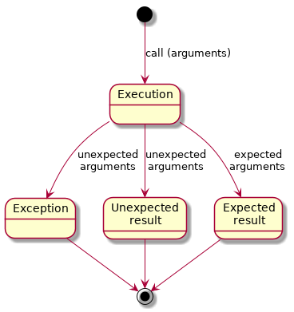
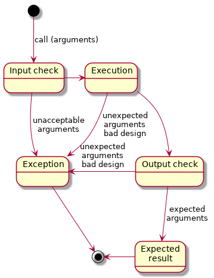
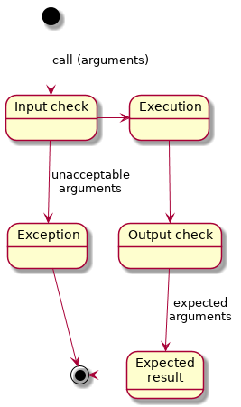

# DE002 Concept Design of the Design by Contract Implementation

## Scope

This document concerns the conceptual design and the requirements for the implementation of the Design by Contract functionality within the **pos** library. It does not provide details on the actual implementation.

## Specification of the Used Notation

The notation used in this document is based on the Augmented Backus-Naur Form notation, see [RFC 5234](https://tools.ietf.org/html/rfc5234) or [Wikipedia](https://en.wikipedia.org/wiki/Augmented_Backus%E2%80%93Naur_form); with just a few extensions.

### RFC 5234 Specification

This section is an extraction from the official specifications of [RFC 5234](https://tools.ietf.org/html/rfc5234) with some abridgments.

#### Rule Naming

The name of a rule is simply the name itself, that is, a sequence of characters, beginning with an alphabetic character, and followed by a combination of alphabetics, digits, and hyphens (dashes). Rule names are case insensitive. The names **rulename**, **Rulename**, **RULENAME**, and **rUlENamE** all refer to the same rule.

**N.B.** the style preferred and used in this document is **all-lower-case-with-hyphens**.

#### Rule Form

A rule is defined by the following sequence:

```abnf
rule = elements
```

where **name** is the name of the rule, **elements** is one or more rule names or terminal specifications. The equal sign separates the name from the definition of the rule. The elements form a sequence of one or more rule names and/or value definitions, combined according to the various operators, such as alternative and repetition.

#### Terminal Values

Rules resolve into a string of terminal values, sometimes called characters. In ABNF, a character is merely a non-negative integer. In certain contexts, a specific mapping (encoding) of values into a character set (such as ASCII) will be specified.

Terminals are specified by one or more numeric characters, with the base interpretation of those characters indicated explicitly. The following bases are currently defined:

```abnf
b = binary
d = decimal
x = hexadecimal
```

Hence:

```abnf
CR = %d13
CR = %x0D
```

respectively specify the decimal and hexadecimal representation of US-ASCII for carriage return.

A concatenated string of such values is specified compactly, using a period (".") to indicate a separation of characters within that value. Hence:

```abnf
CRLF = %d13.10
```

ABNF permits the specification of literal text strings directly, enclosed in quotation marks. Hence:

```abfn
command = "command string"
```

Literal text strings are interpreted as a concatenated set of printable characters. ABNF strings are case insensitive and the character set for these strings is US-ASCII. Hence:

```abnf
rulename = "abc"
```

and:

```abnf
rulename = "ABC"
```

will match "abc", "Abc", "aBc", "abC", "ABc", "aBC", "AbC", and "ABC". A case-sensitive string could only be specified by listing the individual characters: to match “aBc”, the definition would be %d97.66.99

#### Concatenation

A rule can define a simple, ordered string of values (i.e., a concatenation of contiguous characters) by listing a sequence of rule names. For example:

```abnf
foo     =  %x61           ; a
bar     =  %x62           ; b
mumble  =  foo bar foo
```

So that the rule **mumble** matches the lowercase string "aba".

#### Alternatives

Elements separated by a forward slash ("/") are alternatives. Therefore,

```abnf
rulename = foo / bar
```

will accept **foo** or **bar**.

#### Incremental Alternatives

It is sometimes convenient to specify a list of alternatives in fragments.  That is, an initial rule may match one or more alternatives, with later rule definitions adding to the set of alternatives.  This is particularly useful for otherwise independent specifications that derive from the same parent ruleset, such as often occurs with parameter lists.

So that the ruleset

```abnf
ruleset     =  alt1 / alt2
ruleset     =/ alt3
ruleset     =/ alt4 / alt5
```

is the same as specifying

```abnf
ruleset     =  alt1 / alt2 / alt3 / alt4 / alt5
```

#### Value Range Alternatives

A range of alternative numeric values can be specified compactly, using a dash ("-") to indicate the range of alternative values. Hence:

```abnf
DIGIT =  %x30-39
```

is equivalent to:

```abnf
DIGIT =  "0" / "1" / "2" / "3" / "4" / "5" / "6" / "7" / "8" / "9"
```

Concatenated numeric values and numeric value ranges cannot be specified in the same string.  A numeric value may use the dotted notation for concatenation or it may use the dash notation to specify one value range.  Hence, to specify one printable character between end-of-line sequences, the specification could be:

```abnf
char-line = %x0D.0A %x20-7E %x0D.0A
```

#### Sequence Group

Elements enclosed in parentheses are treated as a single element, whose contents are strictly ordered.  Thus,

```abnf
rulename = elem (foo / bar) blat
```

matches (**elem foo blat**) or (**elem bar blat**), and

```abnf
rulename = elem foo / bar blat
```

matches (**elem foo**) or (**bar blat**).

It is strongly advised that grouping notation be used, rather than relying on the proper reading of "bare" alternations, when alternatives consist of multiple rule names or literals.

Hence, it is recommended that the following form be used:

```abnf
rulename = (elem foo) / (bar blat)
```

#### Variable Repetition

The operator "*" preceding an element indicates repetition.  The full form is: {n1}\*{n2}**element** where {n1} and {n2} are optional decimal values, indicating at least {n1} and at most {n2} occurrences of the **element**.

Default values are 0 and infinity so that \***element** allows any number, including zero; 1\***element** requires at least one; 3\*3**element** allows exactly 3; and 1\*2**element** allows one or two.

#### Specific Repetition

A rule of the form: {n}**element** is equivalent to {n}\*{n}**element**. That is, exactly {n} occurrences of **element**.  Thus, **2DIGIT** is a 2-digit number, and **3ALPHA** is a string of three alphabetic characters.

#### Optional Sequence

Square brackets enclose an optional element sequence: **[foo bar]** is equivalent to \*1(**foo bar**).

#### Comment

A semicolon starts a comment that continues to the end of line.  This is a simple way of including useful notes in parallel with the  specifications.

#### Operator Precedence

The various mechanisms described above have the following precedence, from highest (binding tightest) at the top, to lowest (loosest) atthe bottom:

* Rule name, prose-val, Terminal value
* Comment
* Value range
* Repetition
* Grouping, Optional
* Concatenation
* Alternative

Use of the alternative operator, freely mixed with concatenations, can be confusing. It is recommended that the grouping operator be used to make explicit concatenation groups.

#### Core Rules

```abnf
ALPHA      =  %x41-5A / %x61-7A   ; A-Z / a-z
BIT        =  "0" / "1"
CHAR       =  %x01-7F             ; any 7-bit US-ASCII character, excluding NUL
CR         =  %x0D                ; carriage return ("\r")
CRLF       =  CR LF               ; Internet standard newline
CTL        =  %x00-1F / %x7F      ; controls
DIGIT      =  %x30-39             ; 0-9
DQUOTE     =  %x22                ; " (Double Quote)
HEXDIG     =  DIGIT / "A" / "B"
HEXDIG     =/ "C" / "D" / "E" / "F"
HTAB       =  %x09                ; horizontal tab
LF         =  %x0A                ; linefeed ("\n")
LWSP       =  *(WSP / CRLF WSP)   ; linear white space (past new line)
OCTET      =  %x00-FF             ; 8 bits of data
SP         =  %x20                ; space (" ")
VCHAR      =  %x21-7E             ; visible (printing) characters
WSP        =  SP / HTAB           ; white space
```

### Extended Rules

The ABNF is a metalanguage describing a formal system of a language to be used, for example, as a bidirectional communications protocol. It is based on Backus-Naur Form, which is a notation technique for *context-free grammars*. The purpose of this document is not to construct a lexer / parser but to provide a definition of and relation betweeen different checks which consistute the Design by Contract as well as to identify the required input parameters for these checks. Thus the rules to be described do not have to fall within a *formal grammar* category. The ABNF as a metalanguage with just a few additions is more than adequate for the these tasks.

#### Terminal Values

[RFC 7405](https://tools.ietf.org/html/rfc7405) added a syntax for case-sensitive strings: %s"aBc" will only match "aBc". A string can also be explicitly specified as case-insensitive with a %i prefix.

#### Terminal Rule

A phrase between angular brackets (<...>) gives an informal description of the defined rule, which cannot be further trasformed into other rules or a set of terminal values. For instance, a call to a specific function or application of a specific operator of the Python language. E.g.

```abnf
number-of-arguments = <len() function applied to the list of passed arguments>
```

#### Exclusion

The binary operator "^" can be used between a range of terminal values on the left hand, and a single terminal value or a range of the terminal values on the right hand - in the sense of any terminal value from the left-hand range except one or more values.

```abnf
exception-rule  = %x41-5A ^ %x45        ; A-D / F-Z
```

is equivalent to

```abnf
exception-rule  = %x41-44 / %x47-5A     ; A-D / F-Z
```

More than a single value may be excluded using ranges on both sides:

```abnf
exception-rule  = %x41-5A ^ %x45-48     ; A-D / I-Z
```

is equivalent to

```abnf
exception-rule  = %x41-44 / %x49-5A     ; A-D / I-Z
```

The right-hand part (exclusion) can also be expressed as a *group of alternatives* instead of ranges, hence:

```abnf
exception-rule  = %x41-5A ^ ("E" / "F" / "G" / "H")
                                        ; A-D / I-Z
```

is exactly the same as above, but the range notation is less confusing. The use of a *group of alternatives* is appropriate, when all exclusions cannot be defined as a continuous range of terminal ranges. A *group of alternatives* may include ranges as the individual alternatives. A *group of alternatives* may also be used as the left hand part, e.g.:

```abnf
exception-rule  = (%x41-5A / %x61-7A) ^ %x49-5A
                                        ; A-D / I-Z / a-z
```

The *rules* can be used on the both sides but only if they can be reduced to either a *range* or *group of alternatives* of the terminal values or terminal rules:

```abnf
exception-rule  = ALPHA ^ %x49-5A       ; A-D / I-Z / a-z
```

is the same rule.

#### Variable Alternatives Group

The standard ABFN *alternatives* operator '/' is, in fact, **XOR** conjunction, since only a single variant of the alternative rules can appear at the same time, i.e. either rule 1 or rule 2, etc., but not together. The *variable alternatives group* concerns the following situations:

* Logical **AND** grouping - all grouped (unigue) rules must be present, but their order is not fixed
* Logical **OR** grouping - any combination of the (unique) rules from the group, and in any order, must be present

Hence:

```abnf
and-alternative-group = &(foo bar baz)
```

is a syntax sugar for

```abnf
and-alternative-group = (foo bar baz) / (foo baz bar) / (bar foo baz)
and-alternative-group =/ (bar baz foo) / (baz foo bar) / (baz bar foo)
```

whereas

```abnf
or-alternative-group = |(foo bar baz)
```

is a syntax sugar for

```abnf
or-alternative-group = (foo bar baz) / (foo baz bar) / (bar foo baz)
or-alternative-group =/ (bar baz foo) / (baz foo bar) / (baz bar foo)
or-alternative-group =/ (foo bar) / (bar foo) / (foo baz) / (baz foo)
or-alternative-group =/ (bar baz) / (baz bar) / foo / bar / baz
```

The last variant is more difficult to read due to its length. **Note** that both variants are confusing (for parsing) if followed by a rule or terminal value also used within the group.

Therefore, the convention (but not the strict rule) is to use the **AND** grouping (as **&(...)**) only for the fixed amount of rules, that can follow in an arbitrary order but strictly as a sequence. The **OR** grouping (as **|(...)**) is appropriate only as a *final* rule, i.e. the last one in the process / session flow, or followed by a specific *terminator*.

#### Repetitive Variable Alternatives Group

The *variable alternatives group* with the fixed amount of rules, i.e. **AND** conjunction, can be repeated.

*Zero or one repetition*

```abnf
repeated-and-alternative-group = &(foo bar baz)?
```

is the same as

```abnf
repeated-and-alternative-group  = *1and-alternative-group
and-alternative-group           = &(foo bar baz)
```

*Zero or more repetitions*

```abnf
repeated-and-alternative-group = &(foo bar baz)*
```

is the same as

```abnf
repeated-and-alternative-group  = *and-alternative-group
and-alternative-group           = &(foo bar baz)
```

*One or more repetitions*

```abnf
repeated-and-alternative-group = &(foo bar baz)+
```

is the same as

```abnf
repeated-and-alternative-group  = 1*and-alternative-group
and-alternative-group           = &(foo bar baz)
```

*N to M repetitions*

```abnf
repeated-and-alternative-group = &(foo bar baz){5,9}
```

is the same as

```abnf
repeated-and-alternative-group  = 5*9and-alternative-group
and-alternative-group           = &(foo bar baz)
```

*Exactly N repetitions*

```abnf
repeated-and-alternative-group = &(foo bar baz){5}
```

is the same as

```abnf
repeated-and-alternative-group  = 5and-alternative-group
and-alternative-group           = &(foo bar baz)
```

## Conceptual Design and Required Functionality

### Normal and Contracted Function Call

Considering the Python language syntax the usual function call is expressed as:

```abnf
function-call           = function-name "(" [arguments] ")"

function-name           = identifier

arguments               = positional-arguments / keyword-arguments
arguments               =/ positional-arguments "," keyword-arguments

positional-arguments    = arg-value / 1*(arg-value ",") arg-value

keyword-arguments       = arg-name "=" arg-value
keyword-arguments       =/ 1*(arg-name "=" arg-value ",") arg-name "=" arg-value

arg-value               = <any Python supported data type>

arg-name                = identifier

identifier              = ALPHA / "_") *(ALPHA / DIGIT / "_")
```

The contracted function call, under the hood (see [PA002](../Problem_Analysis/PA002_Decorators/PA002_Decorators.md)), is

```abnf
contract-function-call  = function-name "(" function-name "," arguments ")"
```

Thus, the contract checking function *contract-function* receives the reference to another function *actual-function* as its first argument, followed by all arguments intended for the *actual-function*. The *contract-function* performs checks on the arguments intended for the *actual-function*, and calls the *actual-function* with theese arguments only if the checks are successful. The *contract-function* receives and checks the result of that call, and forwards the received data is it also passed the checks. If no checks are defined for ether input or output - they are considered to be successful by default.

The State Diagram of a normal function call is given in [Illustration 1](#ill1). Depending on the input (passed arguments) a function can return either an expected or unexpected data, or even an unpredictable exception can be raised.

<a id="ill1">Illustration 1</a>



The *input data check* part of the design contract is responsible for rejecting *unacceptable input* (wrong type / value of at least one of the arguments, wrong number of arguments, etc.), which still results in an exception being raised (see [Illustration 2](#ill2)), except for the fact that a *specific exception* is raised in a controlled situation, which can be unambiguously interpreted and handled. The *output data check* controls that the function returns the expected result (type / value range, etc.), and it can result in an exception (again, controllable situation, specific exception). Such situation indicates design fault: either the implementation or the wrong / insufficiently defined contract on the input data. Still, an unexpected exception can be raised during the execution of the actual function call, which also indicates a design fault.

<a id="ill2">Illustration 2</a>



With thorough and systematic unit testing during the development, the 'execution time' and 'output check time' exceptions are eliminated, and the controlled function is guaranteed to return expected result with expected input, or a known class of exception is raised in the controlled situation if the input is inappropriate, as in [Illustration 3](#ill3)

<a id="ill3">Illustration 3</a>



### Definition of a Design Contract for a Function

At the most basic level, a Design Contract must include a (reference to) function, to which it is to be applied, and the input or output checks definitions, or both.

```abnf
design-contract-f-check = function-name SEP arguments SEP input-checks
                            *1(SEP output-checks)
design-contract-f-check  =/ function-name SEP output-checks

SEP                     = <separator between the contract definition parts>
                            ; implementation specific
```

#### Input Checks

The checks on the input data (passed arguments) may include:

* Check on the number of received arguments
* Check that passed keyword arguments names are defined
* One or more checks on the specific argument(s)
  - type check(s) on the passed argument
  - value check(s) on the passed argument

##### Number of Received Arguments

The check on the number of the received arguments can be handy in the situations, when a function to be controlled can accept variable number of arguments. Consider the following function definition:

```python
def SomeFunction(a, b):
    #function body
```

If this function is called with any amount of arguments but 2 the **TypeError** exception is raised. However, if we add two default value parameters as in the sniplet below, the function can be called with 2, 3 or 4 arguments!

```python
def SomeFunction(a, b, c = None, d = None):
    #function body
```

Futhermore, the values for the last two parameters can be passed either as positional or as keyword arguments. For example, all calls listed below are valid:

* SomeFunction(1, 2)
* SomeFunction(1, 2, 3)
* SomeFunction(1, 2, 3, 4)
* SomeFunction(1, 2, c = 3)
* SomeFunction(1, 2, d = 4)
* SomeFunction(1, 2, c = 3, d = 4)
* SomeFunction(1, 2, d = 4, c = 3)
* SomeFunction(1, 2, 3, d = 4)

But the call SomeFunction(1, 2, 3, c = 4) is illegal (since c has already received the value 3) and results in the **TypeError** exception.

The situation becomes even more unpredicable if the optional positional and keyword arguments are used. For instance, the following definition:

```python
def SomeFunction(a, b, c = None, d = None, *args, **kwargs):
    #function body
```

is completely legal, since it complies with the allowed syntax

```abnf
function-definition     = "def" function-name "(" [parameter-list] "):" f-body

parameter-list          = [fixed-arguments]
parameter-list          =/ fixed-arguments ["," additional-arguments]
parameter-list          =/ additional-arguments

f-body                  = <any amount of proper Python statements>
                            ; body of the function

fixed-arguments         = mandatory-arguments / default-value-arguments
fixed-arguments         =/ mandatory-arguments "," default-value-arguments

mandatory-arguments     = identifier *("," identifier)

default-value-arguments = identifier "=" arg-value
                            *("," identifier "=" arg-value)

additional-arguments    = "*" identifier ["," "**" identifier] / "**" identifier
```

So, the proper calling syntax for the function defined as above is

```abnf
proper-call             = arg-value "," arg-value *("," arg-value)
                            *("," arg-name "=" arg-value)
```

The first two recived arguments (positional) are mapped onto the *a* and *b* parameters. The next (3rd) positional argument, if present, is mapped onto the *c* parameter. The next (4th) positional argument, if present, is mapped onto the *d* parameter. If there are more than 4 positional arguments, the rest of them (5th and beyond) are accumulated in a tuple referenced by the *arg* parameter.

If there are only 2 positional arguments, the values of the *c* and / or *d* parameters can be passed as keyword arguments. The *d* parameter can be set also via the keyword argument if there are 3 positional arguments. The keyword arguments with the different names than *c* or *d* are accumulated in a dictionary referenced by the *kwargs* parameter.

Finally, if the values of the *c* and / or *d* parameters cannot be taken from the positional or keyword arguments, their default values are used.

The table below gives examples of the arguments -> parameters mapping, assuming the function definition as above.

| Arguments             | Ok?   |  a    |  b    |  c    |  d    | args   | kwargs  |
| :-------------------: | :---: | :---: | :---: | :---: | :---: | :----: | :-----: |
| ()                    | NOK   |       |       |       |       |        |         |
| (1)                   | NOK   |       |       |       |       |        |         |
| (1, 2)                | OK    | 1     | 2     | None  | None  | ()     | {}      |
| (1, 2, 3)             | OK    | 1     | 2     | 3     | None  | ()     | {}      |
| (1, 2, c=3)           | OK    | 1     | 2     | 3     | None  | ()     | {}      |
| (1, 2, 3, c=3)        | NOK   |       |       |       |       |        |         |
| (1, 2, c=3, 4)        | NOK   |       |       |       |       |        |         |
| (1, 2, 3, d=4)        | OK    | 1     | 2     | 3     | 4     | ()     | {}      |
| (1, 2, c=3, d=4)      | OK    | 1     | 2     | 3     | 4     | ()     | {}      |
| (1, 2, d=4, c=3)      | OK    | 1     | 2     | 3     | 4     | ()     | {}      |
| (1, 2, d=4, c=3, e=5) | OK    | 1     | 2     | 3     | 4     | ()     | {"e":5} |
| (1, 2, c=3, d=4, e=5) | OK    | 1     | 2     | 3     | 4     | ()     | {"e":5} |
| (1, 2, d=4, e=5)      | OK    | 1     | 2     | None  | 4     | ()     | {"e":5} |
| (1, 2, c=3, e=5)      | OK    | 1     | 2     | 3     | None  | ()     | {"e":5} |
| (1, 2, e=5)           | OK    | 1     | 2     | None  | None  | ()     | {"e":5} |
| (1, 2, 3, e=5)        | OK    | 1     | 2     | 3     | None  | ()     | {"e":5} |
| (1, 2, 3, 4, e=5)     | OK    | 1     | 2     | 3     | 4     | ()     | {"e":5} |
| (1, 2, 3, 4, 6, e=5)  | OK    | 1     | 2     | 3     | 4     | (6)    | {"e":5} |
| (1, 2, 3, 4, 5, 6)    | OK    | 1     | 2     | 3     | 4     | (5, 6) | {}      |


In order to avoid confusion and to simplify the checks, the following rules MUST be applied during the development and use of the functions:

* Do not mix the default parameters and arbitrary number of optional positional parameters in the function definition
  - def **func(arg1, arg2)** - Ok
  - def **func(arg1, arg2, \*args)** - Ok
    + but **func(arg1, arg2, arg3)** where *arg3* is a **list** is much better!
  - def **func(arg1, arg2, arg3 = def_value)** - Ok
  - def **func(arg1, arg2, arg3 = def_value, \*\*kwargs)** - Ok
  - def **func(arg1, arg2,  \*\*kwargs)** - Ok
  - def **func(arg1, arg2, \*args, \*\*kwargs)** - Ok for wrapper functions and special methods, should be avoided otherwise
  - def **func(\*args, \*\*kwargs)** - Ok for wrapper functions and special methods, should be avoided otherwise
  - def **func(arg1, arg2, arg3 = def_value, \*args)** - _**NOK**_!
  - def **func(arg1, arg2, arg3 = def_value, \*args, \*\*kwargs)** - _**NOK**_ - the worst possible pattern!
* Use the default parameters only as 'switches' to alter the behaviour of a function based on the mandatory parameter, not to receive extra data
* Pass the value(s) of the default parameters only as keyword arguments - never as positional

_**The typical use vs definition patterns**_.

Exactly N >= 0 arguments are required without 'switches'. Check ' == N'.

```python
def SomeFunc(arg1, arg2, ..., argN):
    #body
```

From N >= 0 to M > N arguments are required without 'switches'. Check ' >= N AND <= M '.

```python
def SomeFunc(arg1, arg2, ..., argN, *args):
    #body
```

Note, is N is too large (>3 ?), the alternative is

```python
def SomeFunc(*args):
    #body
```

Exactly N >= 0 arguments are required with 'switches'. Check ' == N'. Additional check, that the names of all passed keyword arguments can be mapped onto the default value parameters. The second check is required to avoid the **TypeError** exception if at least one of the names of the keyword arguments is not within the default parameters.

```python
def SomeFunc(arg1, ..., argN, def_arg1 = Value1, ..., def_argK = ValueK):
    #body
```

The check on the names of the passed keyword arguments is not really necessary if there is a *placeholder* for the 'uknown' keywords. Still check ' == N' is required.

```python
def SomeFunc(arg1, ..., argN, defarg1 = Val1, ..., defargK = ValK, **kwargs):
    #body
```

However, the behaviour of such a function may be confusing for the user: he may mistype the actual name of the default parameter to be passed as a keyword argument, and wonder why the 'switch' is not working. This pattern should be used with caution. It is appropriate is the function has to accumulate some extra 'switches', which it does not use itself, but passes to another function. But a better solution would be not to use 'switches' in the function itself but to force the use to pass all value as mandatory arguments, and only the data to pass further - as keyword arguments. Still check ' == N' is required.

```python
def SomeFunc(arg1, ..., argN, **kwargs):
    #body
```

Finally, for the wrappers and special functions / methods, which mostly pass the data through to another function / method (e.g. a method of the super class) the following definition is not only allowed but often even required (for generality). No checks are required. Such function is not, generally, supposed to be under Design by Contract control.

```python
def SomeFunc(*args, **kwargs):
    #body
```

But the last definition is at heart of the Design by Contract implementation via decorators, see [PA002](../Problem_Analysis/PA002_Decorators/PA002_Decorators.md), specifically [pa002_decorators_test009.py](../Problem_Analysis/PA002_Decorators/pa002_decorators_test009.py)

```python
#...
def function_dbc(dictLookUp):
    #...
    def wrapper(input_func):
        #...
        @functools.wraps(input_func)
        def decorated(*args, **kwargs):
            #input checks
            #...
            gResult = input_func(*args, **kwargs)
            #ouput checks
            #...
            return gResult
        return decorated
    return wrapper
#...
@function_dbc(GLOBAL_DBC)
def test_function(a, b, *args, **kwargs):
    #...
    return '{} != {}'.format(a, b)
```

Thus, the number of the positional arguments passed to the **test_function**() upon its *decorated* call can be checked by the **decorated**() function (closure within **wrapper**(), which is closure within **function_dbc**()) as **len(args)**; and the names of the keyword arguments passed to the **test_function**() - as **kwargs.keys()**.

Furthermore, the **inspect.getargspec**() function from the Standard Library can be used to examine the definition of another function and to check, if the **\*args, \*\*kwargs** passed to the wrapper closure can be properly mapped onto the parameters of the wrapped function. Another function from the same module - **inspect.getcallargs**() - can be used instead, but within **try: ... except TypeError: ...** construct. With the second function the mapping of the arguments onto the wrapped function parameters can be inspected directly, unless it is not possible bue to signature mismatch, i which case the **TypeError** exception is raised.

To summarize, the function definition, suitable for the Design by Contract control, can be expressed as:

```abnf
proper-func-def-dbc     = identifier *("," identifier)
                            ["," "*" ["*"] identifier]
                            ; arg1 /, ..., argN /, *args// OR
                            ; arg1 /, ..., argN /, **kwargs//
proper-func-def-dbc     =/ identifier *("," identifier)
                            1*("," identifier "=" arg-val) ["," "**" identifier]
                            ; arg1 /, ..., argN/, key1=val1, ... /, **kwargs///
proper-func-def-dbc     =/ 1*(identifier "=" arg-val ",") ["**" identifier]
                            ; /key1=val1, ... /, **kwargs//
proper-func-def-dbc     =/ ["*" ["*"] identifier]
                            ; () OR *args OR **kwargs
proper-func-def-dbc     =/ "*" identifier, "**" identifier
                            ; *args, **kwargs
```

The check on the number of the received arguments, exluding keyword ones, is defined as:

```abnf
number-of-args-check    = length-of 1*2(SEP logic-comparison^NEQ SEP 1*DIGIT)
                            SEP
                            ; applied to the received positional arguments

length-of               = <len() function>

logic-comparison        = ">" / "<" / "==" / ">=" / "<=" / "<>" / "!="

NEQ                     = "<>" / "!="
```

The number of the positional arguments recieved (length of **args**) must be compared with the pre-defined non-negative integer. There mey be more than one comparison, e.g. min and max allowed number. The 'not equal' comparison does not make sense for the number of the received arguments, therefore, it is removed.

##### Names of the Keyword Arguments

If this check is defined, all names encountered amongst the received keyword arguments must be present in the 'control' list as well:

```abnf
kwargs-names-check      = in-check 1*(SEP DQUOTE arg-name DQUOTE) SEP
                            ; applied to each of the received keyword arguments
                            ; and compared with the defined list of names

in-check                = <some value in some set / list>
```

##### Argument Checks

The argument checks must be defined and performed separately for each argument to be controlled. The mandatory and default parameters` values are mapped to their names using **args** and **kwargs** passed arguments, so they can be addressed by these names. The optional positional arguments (the remaining of the unmapped **args** arguments) can be addressed by their index.

For each argument the check may be:

* a number of values checks using AND conjunction of the results
* a number of types checks using OR conjunction of the results
* a number of complex type + value checks using OR conjunction of the results; for each of the type check a number of the value checks can be defined using AND conjunction
* a 'callable' check, i.e. the argument is a reference to a function / method (optionally) with a specific signature

The value check is either a logical comparison with a specific value, excluding 'equal to', or a check that the value of the argument is within a set of the defined values, or that the value is within or outside a specific range of the values.

```abnf
argument-check          = (DQUOTE arg-name DQUOTE / 1*DIGIT) SEP
                            (1*((type-check / value-check) *(SEP value-check)) /
                            callable-check) SEP

value-check             = (logic-comparison^"==" SEP arg-value)
value-check             =\ (in-check / not-in-check) 1*(SEP arg-value)

value-check             =\ (in-range / in-lrange / in-rrange / in-drange /
                            not-in-range / not-in-lrange / not-in-rrange /
                            not-in-drange) 2(SEP arg-value)

not-in-check            = <logical negation (NOT) of in-check>

in-range                = <some value within (a,b) range, i.e. > a and < b>

in-lrange                = <some value within [a,b) range, i.e. >= a and < b>

in-rrange                = <some value within (a,b] range, i.e. > a and <= b>

in-drange                = <some value within [a,b] range, i.e. >= a and <= b>

not-in-range            = <logical negation (NOT) of in-range>

not-in-lrange            = <logical negation (NOT) of in-lrange>

not-in-rrange            = <logical negation (NOT) of in-rrange>

not-in-drange            = <logical negation (NOT) of in-drange>
```

The inside range checks can be defined as 2 simple logical comparisons with the AND conjunction, thus they can be considered as a syntax sugar. The outside range checks, however, can be replaced by 2 simple logical comparisons with OR conjuction, which contradicts the convention above. Therefore, they MUST be defined as separate rules / operations. On the implementation level they can be simply negation of the inside range checks.

The type check can be of two types: 'IS A' (instance or subclass check) or 'HAS A' (duck typing check).

For the 'IS A' check the argument can be compared with one or more possible options, in which case the OR conjunction is applied for the boolean results of the individual results. With the multiple options - the argument being checked is allowed to be a subclass / instance of any of the options. The 'is an instance' or 'is a subclass' checks can also be negated (logical NOT applied to the result). All values checks following this type check and before the next type check definition or the end of this argument contract are combined using AND conjuction.

Example. An argument can be a positive number or None, thus the type + value checks can be formulated as:

* argument is an instance of **int** OR **long** OR **float**; AND argument is > 0 - type + value check
* OR; argument is an instance of **NoneType** - type check

In the case of the sequence type check, i.e. list, tuple, etc., but not a string, instead of value check(s) the number of elements check and type / value check on all elements or type / value checks on individual elements (by index) can be added.

This arrangement allows compex checks on the container objects, for instance:

* that an argument is a list or tuple of, at least, given length and contains only positive numbers
* that an argument is a 2-elements tuple with the first element being a string and the second - integer

The 'IS A' check can be complemented by any number of the 'HAS A' checks. The type checks on the specific argument can also consist of only 'HAS A' checks.

The 'HAS A' check includes mandatory check on that an attribute with the given name is present within the attributes of the argument being checked, and it may be followed by an arbitrary amount of the type / value checks or a single callable check applied to this attribute.

The callable check includes mandatory check on that an attribute is a callable object, e.g. function or method, or an object with the \_\_call\_\_() method defined, followed by an optional input and / or output checks.

```abnf
type-check              = [NOT] (is-instance / is-subclass) 1*(SEP class-name)
                            *(SEP has-attribute-check)
type-check              =/ has-attribute-check *(SEP has-attribute-check)
type-check              =/ is-instance SEP sequence [SEP sequence-length-check] 
                            ((SEP (type-check / value-check) *(SEP value-check))
                            / (1*(SEP 1*DIGIT (1*((type-check / value-check)
                            *(SEP value-check)) / callable-check)))

NOT                     = <logical NOT negation of the next rule`s bool result>

is-instance             = <isinstance() function based check>

is-subclass             = <issubclass() function based check>

class-name              = DQUOTE identifier DQUOTE
                            ; built-in type or custom class name in quotes

has-attribute-check     = DQUOTE identifier DQUOTE SEP is-present-check SEP
                            1*(SEP attr-name (1*((type-check / value-check)
                            *(SEP value-check)) / callable-check))

sequence                = <list, tuple or any compatible container class>
                            ; excluding stings!

sequence-length-check   = length-of 1*2(SEP logic-comparison^NEQ SEP 1*DIGIT)
                            SEP
                            ; applied to the sequence type

callable-check          = is-callable [SEP input-checks] [SEP output-checks]

is-present-check        = <hasattr() function based check>

attr-name               = DQUOTE identifier DQUOTE
```

The type check definition is recursive, which reflects the fact that a type check contract for a single compound argument (container, or class instance, etc.) of a function can include nested type checks and even nested other functions` contract checks.

Finally, the definition of the input checks is:

```abnf
input-checks            = |(number-of-args-check kwargs-names-check
                            *(argument-check))
```

#### Ouput Checks

foo

### Summary

The concept of the Design by Contract approach to be implemented can be summarized as:

```abnf
function-call           = function-name "(" [arguments] ")"

function-name           = identifier

arguments               = positional-arguments / keyword-arguments
arguments               =/ positional-arguments "," keyword-arguments

positional-arguments    = arg-value / 1*(arg-value ",") arg-value

keyword-arguments       = arg-name "=" arg-value
keyword-arguments       =/ 1*(arg-name "=" arg-value ",") arg-name "=" arg-value

arg-value               = <any Python supported data type>

arg-name                = identifier

identifier              = ALPHA / "_") *(ALPHA / DIGIT / "_")

function-definition     = "def" function-name "(" [parameter-list] "):" f-body

parameter-list          = [fixed-arguments]
parameter-list          =/ fixed-arguments ["," additional-arguments]
parameter-list          =/ additional-arguments

f-body                  = <any amount of proper Python statements>
                            ; body of the function

fixed-arguments         = mandatory-arguments / default-value-arguments
fixed-arguments         =/ mandatory-arguments "," default-value-arguments

mandatory-arguments     = identifier *("," identifier)

default-value-arguments = identifier "=" arg-value
                            *("," identifier "=" arg-value)

additional-arguments    = "*" identifier ["," "**" identifier] / "**" identifier

contract-function-call  = function-name "(" function-name "," arguments ")"

proper-func-def-dbc     = identifier *("," identifier)
                            ["," "*" ["*"] identifier]
                            ; arg1 /, ..., argN /, *args// OR
                            ; arg1 /, ..., argN /, **kwargs//
proper-func-def-dbc     =/ identifier *("," identifier)
                            1*("," identifier "=" arg-val) ["," "**" identifier]
                            ; arg1 /, ..., argN/, key1=val1, ... /, **kwargs///
proper-func-def-dbc     =/ 1*(identifier "=" arg-val ",") ["**" identifier]
                            ; /key1=val1, ... /, **kwargs//
proper-func-def-dbc     =/ ["*" ["*"] identifier]
                            ; () OR *args OR **kwargs
proper-func-def-dbc     =/ "*" identifier, "**" identifier
                            ; *args, **kwargs

design-contract-f-check = function-name SEP arguments SEP input-checks
                            *1(SEP output-checks)
design-contract-f-check  =/ function-name SEP output-checks

SEP                     = <separator between the contract definition parts>
                            ; implementation specific

input-checks            = |(number-of-args-check kwargs-names-check
                            *(argument-check))

number-of-args-check    = length-of 1*2(SEP logic-comparison^NEQ SEP 1*DIGIT)
                            SEP
                            ; applied to the received positional arguments

kwargs-names-check      = in-check 1*(SEP DQUOTE arg-name DQUOTE) SEP
                            ; applied to each of the received keyword arguments
                            ; and compared with the defined list of names

argument-check          = (DQUOTE arg-name DQUOTE / 1*DIGIT) SEP
                            (1*((type-check / value-check) *(SEP value-check)) /
                            callable-check) SEP

length-of               = <len() function>

logic-comparison        = ">" / "<" / "==" / ">=" / "<=" / "<>" / "!="

NEQ                     = "<>" / "!="

in-check                = <some value in some set / list>

type-check              = [NOT] (is-instance / is-subclass) 1*(SEP class-name)
                            *(SEP has-attribute-check)
type-check              =/ is-instance SEP sequence [SEP sequence-length-check] 
                            ((SEP (type-check / value-check) *(SEP value-check))
                            / (1*(SEP 1*DIGIT (1*((type-check / value-check)
                            *(SEP value-check)) / callable-check)))

value-check             = (logic-comparison^"==" SEP arg-value)
value-check             =\ (in-check / not-in-check) 1*(SEP arg-value)

value-check             =\ (in-range / in-lrange / in-rrange / in-drange /
                            not-in-range / not-in-lrange / not-in-rrange /
                            not-in-drange) 2(SEP arg-value)

not-in-check            = <logical negation (NOT) of in-check>

in-range                = <some value within (a,b) range, i.e. > a and < b>

in-lrange                = <some value within [a,b) range, i.e. >= a and < b>

in-rrange                = <some value within (a,b] range, i.e. > a and <= b>

in-drange                = <some value within [a,b] range, i.e. >= a and <= b>

not-in-range            = <logical negation (NOT) of in-range>

not-in-lrange            = <logical negation (NOT) of in-lrange>

not-in-rrange            = <logical negation (NOT) of in-rrange>

not-in-drange            = <logical negation (NOT) of in-drange>

NOT                     = <logical NOT negation of the next rule`s bool result>

is-instance             = <isinstance() function based check>

is-subclass             = <issubclass() function based check>

class-name              = DQUOTE identifier DQUOTE
                            ; built-in type or custom class name in quotes

has-attribute-check     = DQUOTE identifier DQUOTE SEP is-present-check SEP
                            1*(SEP attr-name (1*((type-check / value-check)
                            *(SEP value-check)) / callable-check))

sequence                = <list, tuple or any compatible container class>
                            ; excluding stings!

sequence-length-check   = length-of 1*2(SEP logic-comparison^NEQ SEP 1*DIGIT)
                            SEP
                            ; applied to the sequence type

callable-check          = is-callable [SEP input-checks] [SEP output-checks]

is-present-check        = <hasattr() function based check>

attr-name               = DQUOTE identifier DQUOTE
```