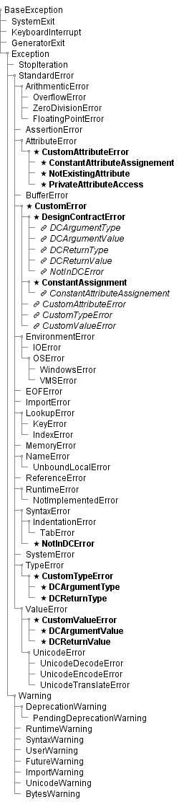

# PA003 Problem Analysis on Usage of Virtual Inhertance of Exception Sub-Classes

## Introduction

The idea is to create specific exceptions for the cases of the violation of the assumptions / restrictions of the added functionality, for instance – the Design by Contract and data encapsulation as a part of the data integrity protection implemented via ‘hidden’ attributes. On one hand, these exceptions are required to provide built-in call stack trace-back analysis without interruption of the program, i.e. when they are caught and the exception is not allowed to propagate to the top level (console dump); in which they are drastically different from the built-in exceptions. On the other hand, they should be organically integrated into the use cases of the built-in exceptions, i.e. the type of the custom exception must strictly correspond to a specific situation in the same way as the built-in exceptions do. The preliminary use cases are given below.

* **CustomException** – generic exception to be raised mostly in the debugging context, same as the built-in **StandardError** type; with its two more specific cases:
  - **DesignContractError** – generic error related to the Design by Contract implementation
  - **ConstantAssignment** – generic error related to the assignment to a ‘constant’ type (not part of the standard Python data types!)
* **CustomAttibuteError** – generic umbrella / super-class for the specific situations related to the normal use of the **AttributeError** (built-in) with its specific sub-classes:
  - **ConstantAttributeAssignent** – attempted assignment to a constant / read-only attribute
  - **NotExistingAttribute** – attempted read or write access to a non-existing attribute
  - **PrivateAttributeAccess** – attempted read or write access to an existing ‘hidden’ / ‘private’ attribute
* **NotInDCError** as a specific case of the **SyntaxError**, when a function / method is taken into the Design by Contract scheme (using decorators), but where is no definition of its contract in the corresponding look-up object
* **CustomTypeError** as a specific case of the **TypeError** when the unexpected data is encountered, but not because of the programmers’ error in the code, with its sub-classes specific for the Design by Contract:
  - **DCArgumentType**
  - **DCReturnType**
* CustomValueError as a specific case of the ValueError when the unexpected data is encountered, but not because of the programmers’ error in the code, with its sub-classes specific for the Design by Contract:
  - **DCArgumentValue**
  - **DCReturnValue**

This scheme implies, logically, the following inheritance chains:

1. **BaseException** <|- **Exception** <|- **StandardError** <| - **CustomError** <|- {**DesignContractError**, **ConstantAssignment**}
2. **BaseException** <|- **Exception** <|- **StandardError** <| - **AttributeError** <|- **CustomAttributeError** <|- {**ConstantAttributeAssignent**, **NotExistingAttribute**, **PrivateAttributeAccess**}
3. **BaseException** <|- **Exception** <|- **StandardError** <| -  **SyntaxError** <|- **NotInDCError**
4. **BaseException** <|- **Exception** <|- **StandardError** <| - **TypeError** <|- **CustomTypeError** <|- {**DCArgumentType**, **DCReturnType**}
5. **BaseException** <|- **Exception** <|- **StandardError** <| - **ValueError** <|- **CustomValueError** <|- {**DCArgumentValue**, **DCReturnValue**}

Additionally, it is useful if the **CustomError** can be used as an umbrella class to catch all these user-defined exceptions, since they all should provide trace-back analysis functionality. Similarly, the **DesignContractError** can be used as an umbrella class to catch all Design by Contract related errors, whereas **ConstantAssignment** – to catch **ConstantAttributeAssignment** as well.

These additional requirements / wishes imply complex multiple inheritance scheme, which, potentially, may break the functionality inherited from the intended built-in exception classes parents. In this particular case the *virtual inheritance* seems to be the proper mechanism for the implementation, see <a id="bref1">[<sup>1</sup>](#aref1)</a>.

In short, a registered *virtual subclass* of a class is considered to be its descendant by the ‘is a’ checks (**isinstance**() and **issubclass**() built-in functions) even though the *virtual parent* class is not in the MRO of its virtual subclass. Therefore, the MRO scheme is not affected. This functionality is implemented in the Standard Library module **abc**, see reference above.

There are two principal methods to implement the *virtual inheritance*.

* **register**() method of the meta-class **abc.ABCMeta** – any type passed as an argument of this method’s call on a class created with the **abc.ABCMeta** as its meta-class will register that passed type as a sub-class of this particular class
* class method **\_\_subclasshook\_\_**() implemented within a class using the **abc.ABCMeta** as its meta-class customizes the behaviour of the built-in function **issubclass**() and, therefore, **isinstance**() with this class being the comparison base

Normally, the second method is preferable for the implementation of the duck-typing (‘has a’) types comparison, although ‘is a’ comparison can be used as well.

For instance, the umbrella behaviour of the **CustomError** can be implemented using **\_\_subclasshook\_\_**() method and combination of ‘has a’ and ‘is a’ checks following the rules:

* Any direct or indirect sub-class of **StandardError** built-in exception, which has a specific trace-back analysis method, is considered to be a sub-class (direct, indirect or virtual) of the **CustomError** exception class
* Any class, which is not a direct or indirect sub-class of **StandardError** built-in exception, is not a sub-class of the **CustomError** exception class, even if it doesn’t have this specific method
* Any direct or indirect sub-class of the the **CustomError** exception class (according to the MRO) is considered to be its sub-class, even if it doesn’t have this specific method (**NB** – not the case in the actual implementation to be!)
* Any direct or indirect sub-class of the the **CustomError** exception class doesn’t use these rules, instead, it relies on the standard MRO based ‘is a’ checks

For the **DesignContractError** and **ConstantAssignment** exception classes the use of the register() method is more convenient.

Finally, the ‘is a’ relation between the built-in and custom defined exception classes should follow the scheme given below in [Illustration 1](#ill1). Exceptions given in **bold** with a star symbol form the actual inheritance chain, whereas *virtual membership* of the classes is given in *italic* with a link symbol.

<a id="ill1">**Illustration 1**</a>     [&#x2B0E;](#bill1)



## Method and Results

For the illustration of the principle we define class **CustomException**, which utilizes **abc.ABCMeta** as its meta-class and implements class method **\_\_subclasshook\_\_**() following the recipe above. It has a direct sub-class **DirectChild** and indirect sub-class **IndirectChild**, which is sub-class of the **DirectChild**. The dummy trace-back method to be used for the ‘has a’ check is implemented in the mixin class **MyMixin**. The class **VirtualChild** is direct sub-class of the built-in class **Exception**, thus it is not a sub-class but a sibling of the **CustomException**, but it also inherits from the **MyMixin**. Finally, the class **VirtualGrandchild** is a direct sub-class of the **VirtualChild** class.

```python
from abc import ABCMeta

class CustomException(Exception):
    
    __metaclass__ = ABCMeta
    
    @classmethod
    def __subclasshook__(cls, clsOther):
        if cls is CustomException:
            bCond1 = hasattr(clsOther, 'traceback')
            bCond2 = issubclass(clsOther, Exception)
            if bCond1 and bCond2:
                print 'case 1'
                gResult = True
            elif not bCond2:
                print 'case 2'
                gResult = False
            else:
                print 'case 3'
                gResult = NotImplemented
        else:
            print 'case 4'
            gResult = NotImplemented
        return gResult

class MyMixin(object):
    
    def traceback(self):
        pass

class VirtualChild(Exception, MyMixin):
    pass

class DirectChild(CustomException):
    pass

class VirtualGrandchild(VirtualChild):
    pass

class IndirectChild(DirectChild):
    pass
```

Note that the external **if...else** construct in the **\_\_subclasshook\_\_**() method ensures that the direct and indirect sub-classes of the **CustomException** class rely on the standard MRO based ‘is a’ membership resolution, even though they inherit this method (as ‘case 4’). In the internal **if...elif...else** construct, which is entered only in the **CustomException** class is the comparison base, the **if** branch is entered for any sub-class of the **Exception** class, which has the **traceback**() method (case 1). The **elif** branch is entered if a class to be compared has this method but it is not an exception (case 2). Finally, the **else** branch is entered for any sub-class of **Exception** without the **traceback**() method.

The expected behavior is:

* **CustomException** is sub-class of the **Exception** and itself
* **DirectChild**, **IndirectChild**, **VirtualChild** and **VirtualGrandchild** are all considered to be the sub-classes of both **CustomException** and **Exception**, but **MyMixin** is not a sub-class of either
* **VirtualGrandchild** is sub-class of **VirtualChild** but not of **DirectChild**
* **IndirectChild** is sub-class of **DirectChild** but not of **VirtualChild**

At first, the expected behaviour is tested using **issubclass**() built-in function.

[pa003_virtual_inheritance_test001.py](./pa003_virtual_inheritance_test001.py)

```python
if __name__ == "__main__":
    #at class level
    print 'At class level - issubclass()'
    print "CustomException -|> Exception ?", issubclass(CustomException, Exception)
    print "CustomException -|> CustomException ?", issubclass(CustomException, CustomException)
    print "MyMixin -|> Exception ?", issubclass(MyMixin, Exception)
    print "MyMixin -|> CustomException ?", issubclass(MyMixin, CustomException)
    print "VirtualChild -|> Exception ?", issubclass(VirtualChild, Exception)
    print "VirtualChild -|> CustomException ?", issubclass(VirtualChild, CustomException)
    print "DirectChild -|> Exception ?", issubclass(DirectChild, Exception)
    print "DirectChild -|> CustomException ?", issubclass(DirectChild, CustomException)
    print "VirtualGrandchild -|> Exception ?", issubclass(VirtualGrandchild, Exception)
    print "VirtualGrandchild -|> CustomException ?", issubclass(VirtualGrandchild, CustomException)
    print "IndirectChild -|> Exception ?", issubclass(IndirectChild, Exception)
    print "IndirectChild -|> CustomException ?", issubclass(IndirectChild, CustomException)
    print "VirtualGrandchild -|> VirtualChild ?", issubclass(VirtualGrandchild, VirtualChild)
    print "VirtualGrandchild -|> DirectChild ?", issubclass(VirtualGrandchild, DirectChild)
    print "IndirectChild -|> VirtualChild ?", issubclass(IndirectChild, VirtualChild)
    print "IndirectChild -|> DirectChild ?", issubclass(IndirectChild, DirectChild)
```

**output**

```bash
At class level - issubclass()
CustomException -|> Exception ? True
CustomException -|> CustomException ? case 3
True
MyMixin -|> Exception ? False
MyMixin -|> CustomException ? case 2
False
VirtualChild -|> Exception ? True
VirtualChild -|> CustomException ? case 1
True
DirectChild -|> Exception ? True
DirectChild -|> CustomException ? case 3
True
VirtualGrandchild -|> Exception ? True
VirtualGrandchild -|> CustomException ? case 1
True
IndirectChild -|> Exception ? True
IndirectChild -|> CustomException ? case 3
True
VirtualGrandchild -|> VirtualChild ? True
VirtualGrandchild -|> DirectChild ? case 4
case 4
False
IndirectChild -|> VirtualChild ? False
IndirectChild -|> DirectChild ? case 4
True
```

The behaviour is as expected. Now it is tested using **isinstance**() built-in function.

[pa003_virtual_inheritance_test002.py](./pa003_virtual_inheritance_test002.py)

```python
if __name__ == "__main__":
    #at instance level
    print 'At instance level - isinstance()'
    objTest = CustomException()
    print "CustomException() -> Exception ?", isinstance(objTest, Exception)
    print "CustomException() -> CustomException ?",isinstance(objTest, CustomException)
    objTest = MyMixin()
    print "MyMixin() -> Exception ?", isinstance(objTest, Exception)
    print "MyMixin() -> CustomException ?", isinstance(objTest, CustomException)
    objTest = VirtualChild()
    print "VirtualChild() -> Exception ?", isinstance(objTest, Exception)
    print "VirtualChild() -> CustomException ?", isinstance(objTest, CustomException)
    objTest = DirectChild()
    print "DirectChild() -> Exception ?", isinstance(objTest, Exception)
    print "DirectChild() -> CustomException ?", isinstance(objTest, CustomException)
    objTest = VirtualGrandchild()
    print "VirtualGrandchild() -> Exception ?", isinstance(objTest, Exception)
    print "VirtualGrandchild() -> CustomException ?", isinstance(objTest, CustomException)
    print "VirtualGrandchild() -> VirtualChild ?", isinstance(objTest, VirtualChild)
    print "VirtualGrandchild() -> DirectChild ?", isinstance(objTest, DirectChild)
    objTest = IndirectChild()
    print "IndirectChild() -> Exception ?", isinstance(objTest, Exception)
    print "IndirectChild() -> CustomException ?", isinstance(objTest, CustomException)
    print "IndirectChild() -> VirtualChild ?", isinstance(objTest, VirtualChild)
    print "IndirectChild() -> DirectChild ?", isinstance(objTest, DirectChild)
```

**output**

```bash
At instance level - isinstance()
CustomException() -> Exception ? True
CustomException() -> CustomException ? True
MyMixin() -> Exception ? False
MyMixin() -> CustomException ? case 2
False
VirtualChild() -> Exception ? True
VirtualChild() -> CustomException ? case 1
True
DirectChild() -> Exception ? True
DirectChild() -> CustomException ? case 3
True
VirtualGrandchild() -> Exception ? True
VirtualGrandchild() -> CustomException ? case 1
True
VirtualGrandchild() -> VirtualChild ? True
VirtualGrandchild() -> DirectChild ? case 4
case 4
False
IndirectChild() -> Exception ? True
IndirectChild() -> CustomException ? case 3
True
IndirectChild() -> VirtualChild ? False
IndirectChild() -> DirectChild ? case 4
True
```

Again, as expected, since the **isinstance**() function relies upon **issubclass**() function (it is also clear from the example above). Finally, let’s test using **try...except** approach.

[pa003_virtual_inheritance_test003.py](./pa003_virtual_inheritance_test003.py)

```python
if __name__ == "__main__":
    #in try...except
    print "raise CustomException()"
    try:
        raise CustomException()
    except Exception:
        print 'Caught as Exception'
    except:
        print 'Not caught as Exception'
    try:
        raise CustomException()
    except CustomException:
        print 'Caught as CustomException'
    except:
        print 'Not caught as CustomException'
    print "raise DirectChild()"
    try:
        raise DirectChild()
    except Exception:
        print 'Caught as Exception'
    except:
        print 'Not caught as Exception'
    try:
        raise DirectChild()
    except CustomException:
        print 'Caught as CustomException'
    except:
        print 'Not caught as CustomException'
    try:
        raise DirectChild()
    except DirectChild:
        print 'Caught as DirectChild'
    except:
        print 'Not caught as DirectChild'
    try:
        raise DirectChild()
    except VirtualChild:
        print 'Caught as VirtualChild'
    except:
        print 'Not caught as VirtualChild'
    print "raise VirtualChild()"
    try:
        raise VirtualChild()
    except Exception:
        print 'Caught as Exception'
    except:
        print 'Not caught as Exception'
    try:
        raise VirtualChild()
    except CustomException:
        print 'Caught as CustomException'
    except:
        print 'Not caught as CustomException'
    try:
        raise VirtualChild()
    except DirectChild:
        print 'Caught as DirectChild'
    except:
        print 'Not caught as DirectChild'
    try:
        raise VirtualChild()
    except VirtualChild:
        print 'Caught as VirtualChild'
    except:
        print 'Not caught as VirtualChild'
    print "raise IndirectChild()"
    try:
        raise IndirectChild()
    except Exception:
        print 'Caught as Exception'
    except:
        print 'Not caught as Exception'
    try:
        raise IndirectChild()
    except CustomException:
        print 'Caught as CustomException'
    except:
        print 'Not caught as CustomException'
    try:
        raise IndirectChild()
    except DirectChild:
        print 'Caught as DirectChild'
    except:
        print 'Not caught as DirectChild'
    try:
        raise IndirectChild()
    except VirtualChild:
        print 'Caught as VirtualChild'
    except:
        print 'Not caught as VirtualChild'
    print "raise VirtualGrandchild()"
    try:
        raise VirtualGrandchild()
    except Exception:
        print 'Caught as Exception'
    except:
        print 'Not caught as Exception'
    try:
        raise VirtualGrandchild()
    except CustomException:
        print 'Caught as CustomException'
    except:
        print 'Not caught as CustomException'
    try:
        raise VirtualGrandchild()
    except DirectChild:
        print 'Caught as DirectChild'
    except:
        print 'Not caught as DirectChild'
    try:
        raise VirtualGrandchild()
    except VirtualChild:
        print 'Caught as VirtualChild'
    except:
        print 'Not caught as VirtualChild'
```

**output**

```bash
raise CustomException()
case 3
Caught as Exception
Caught as CustomException
raise DirectChild()
case 4
Caught as Exception
case 3
Caught as CustomException
Caught as DirectChild
Not caught as VirtualChild
raise VirtualChild()
Caught as Exception
case 1
Caught as CustomException
case 4
case 4
Not caught as DirectChild
Caught as VirtualChild
raise IndirectChild()
case 4
Caught as Exception
case 3
Caught as CustomException
case 4
Caught as DirectChild
Not caught as VirtualChild
raise VirtualGrandchild()
Caught as Exception
case 1
Caught as CustomException
case 4
case 4
Not caught as DirectChild
Caught as VirtualChild
```

Again as expected, since **try...except** does ‘is a’ check using **isinstance**() function.

The last example illustrate the use of the **register**() method. The **MyMixin** class is completely removed, so the class **VirtualChild** can no longer be considered a sub-class of the **CustomException** using ‘has a’ check. Instead, it is directly registered as a *virtual sub-class* of **CustomException** using the **register**() method.

[pa003_virtual_inheritance_test004.py](./pa003_virtual_inheritance_test004.py)

```python
from abc import ABCMeta

class CustomException(Exception):
    
    __metaclass__ = ABCMeta
    
    @classmethod
    def __subclasshook__(cls, clsOther):
        if cls is CustomException:
            bCond1 = hasattr(clsOther, 'traceback')
            bCond2 = issubclass(clsOther, Exception)
            if bCond1 and bCond2:
                print 'case 1'
                gResult = True
            elif not bCond2:
                print 'case 2'
                gResult = False
            else:
                print 'case 3'
                gResult = NotImplemented
        else:
            print 'case 4'
            gResult = NotImplemented
        return gResult


class VirtualChild(Exception):
    pass

CustomException.register(VirtualChild)

class DirectChild(CustomException):
    pass

class VirtualGrandchild(VirtualChild):
    pass

class IndirectChild(DirectChild):
    pass

if __name__ == "__main__":
    #in try...except
    print "raise CustomException()"
    try:
        raise CustomException()
    except Exception:
        print 'Caught as Exception'
    except:
        print 'Not caught as Exception'
    try:
        raise CustomException()
    except CustomException:
        print 'Caught as CustomException'
    except:
        print 'Not caught as CustomException'
    print "raise DirectChild()"
    try:
        raise DirectChild()
    except Exception:
        print 'Caught as Exception'
    except:
        print 'Not caught as Exception'
    try:
        raise DirectChild()
    except CustomException:
        print 'Caught as CustomException'
    except:
        print 'Not caught as CustomException'
    try:
        raise DirectChild()
    except DirectChild:
        print 'Caught as DirectChild'
    except:
        print 'Not caught as DirectChild'
    try:
        raise DirectChild()
    except VirtualChild:
        print 'Caught as VirtualChild'
    except:
        print 'Not caught as VirtualChild'
    print "raise VirtualChild()"
    try:
        raise VirtualChild()
    except Exception:
        print 'Caught as Exception'
    except:
        print 'Not caught as Exception'
    try:
        raise VirtualChild()
    except CustomException:
        print 'Caught as CustomException'
    except:
        print 'Not caught as CustomException'
    try:
        raise VirtualChild()
    except DirectChild:
        print 'Caught as DirectChild'
    except:
        print 'Not caught as DirectChild'
    try:
        raise VirtualChild()
    except VirtualChild:
        print 'Caught as VirtualChild'
    except:
        print 'Not caught as VirtualChild'
    print "raise IndirectChild()"
    try:
        raise IndirectChild()
    except Exception:
        print 'Caught as Exception'
    except:
        print 'Not caught as Exception'
    try:
        raise IndirectChild()
    except CustomException:
        print 'Caught as CustomException'
    except:
        print 'Not caught as CustomException'
    try:
        raise IndirectChild()
    except DirectChild:
        print 'Caught as DirectChild'
    except:
        print 'Not caught as DirectChild'
    try:
        raise IndirectChild()
    except VirtualChild:
        print 'Caught as VirtualChild'
    except:
        print 'Not caught as VirtualChild'
    print "raise VirtualGrandchild()"
    try:
        raise VirtualGrandchild()
    except Exception:
        print 'Caught as Exception'
    except:
        print 'Not caught as Exception'
    try:
        raise VirtualGrandchild()
    except CustomException:
        print 'Caught as CustomException'
    except:
        print 'Not caught as CustomException'
    try:
        raise VirtualGrandchild()
    except DirectChild:
        print 'Caught as DirectChild'
    except:
        print 'Not caught as DirectChild'
    try:
        raise VirtualGrandchild()
    except VirtualChild:
        print 'Caught as VirtualChild'
    except:
        print 'Not caught as VirtualChild'
```

**output**

```bash
case 3
raise CustomException()
case 3
Caught as Exception
Caught as CustomException
raise DirectChild()
case 4
Caught as Exception
case 3
Caught as CustomException
Caught as DirectChild
Not caught as VirtualChild
raise VirtualChild()
Caught as Exception
case 3
Caught as CustomException
case 4
case 4
Not caught as DirectChild
Caught as VirtualChild
raise IndirectChild()
case 4
Caught as Exception
case 3
Caught as CustomException
case 4
Caught as DirectChild
Not caught as VirtualChild
raise VirtualGrandchild()
Caught as Exception
case 3
Caught as CustomException
case 4
case 4
Not caught as DirectChild
Caught as VirtualChild
```

Again, the ‘is a’ relation between the exceptions is as desired.

## Conclusion

The proposed method to implement custom exception classes structures emulating the imbalanced multiple inheritance from several exception class as shown in <a id="bill1">[Illustration 1](#ill1)</a> works according the requirements. It is based on the following ‘tricks’:

* implementation of the desired trace-back functionality in a mix-in class, which should be added as a second parent to all ‘heads’ of the custom exceptions sub-trees, i.e. **CustomError**, **CustomAttributeError**, **CustomTypeError** and **CustomValueError** – it will be inherited by all other custom exception classes
* use of the **abc.ABCMeta** as the meta-class for the ‘umbrella’ class **CustomError** – it will be inherited by the custom exception classes **DesignContractError** and **ConstantAssignment**
* implement ‘is a’ and ‘has a’ type check in the class method **\_\_subclasshook\_\_**() for and only for the class **CustomError**
* use method **register**() to add *virtual sub-classes* to the classes **DesignContractError** and **ConstantAssignment**

## References

<a id="aref1">[1]</a> https://docs.python.org/2/library/abc.html   [&#x2B0F;](#bref1)