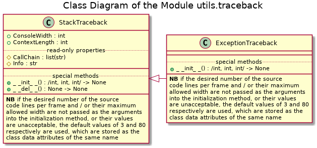
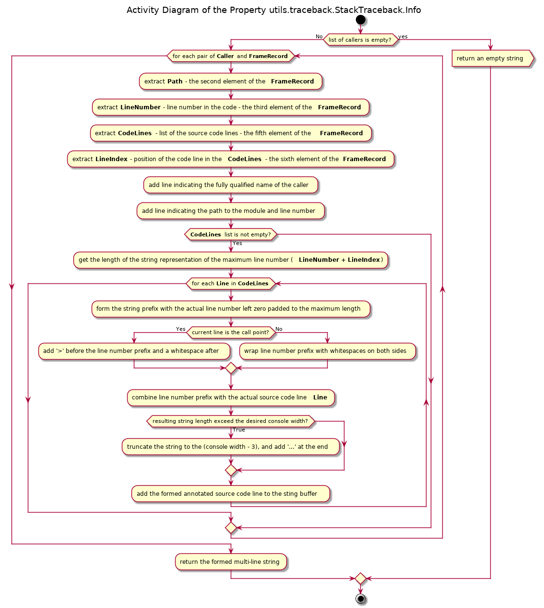

# UD001 Module pos.utils.traceback Reference

## Scope

This document describes the intended usage, design and implementation of the functionality implemented in the module **utils.traceback** of the library **pos**. The API reference is also provided.

The functional objects covered in this document are:

* class **StackTraceback**
* class **ExceptionTraceback**

## Intended Use and Functionality

The class **StackTraceback** is intended as a high-level tool for the analysis of the system call stack, which creates and stores a snapshot of the stack at the moment of its instantiation. Based on the stored stack’s snapshot at any moment upon a request is can provide the call chain as a list of the fully qualified names of the callers (including the module’s name and, if applicable, the class name) as well as the human readable representation of all frame records within the chain as a single string. In the second case the returned string consists of multiple lines separated by the newline character (‘\n’) but with the same number of lines per frame.

The string representation of a single frame in the traceback includes:

* The first line indicating the fully qualified name of the caller
* The second line indicating the path to the corresponding module and line’s number in the source code of the module, where the call is made
* Specified number of the source code lines centred around the one there the call is made, with prefixes showing the line numbers in the code and clearly indicating the ‘call’ line

The system call stack is stored and shown by the class in the bottom-up manner, thus the first / outmost caller (normally, the top level of the interpreter’s loop) is the first element, whereas the last / innermost call frame (where this class is instantiated) being the last element in the list.

During instantiation optional arguments can be passed in order to change the default behaviour of the class:

* Non-negative integer number of the deepest / innermost frames to exclude from the traceback – e.g. to ‘hide’ calls to some helper functions / methods
* Non-negative integer number as the desired number of the source code lines to be shown per frame record – the default value is 3
* Non-negative integer number as the maximum width of the source code lines including the line number prefix to be shown; longer source code lines will be truncated – the default value is 80

The intended use of this class is for the debugging / profiling, especially for the analysis of the program flow branching under different input data.

The class **ExceptionTraceback** is intended as the same functionality high-level tool for the analysis of the traceback of the exception being handled currently, i.e. the list of the frame records between the frame where the exception is raised and the frame where it is being handled. The common convention is to enclose the critical part of the code within the **try…except** clause. In this case the traceback of the exception caught and being handled in the except branch starts from a call made within the **try** branch (the first element) and ends at the frame where this exception has been raised (the last element). In the marginal case the traceback may consist of a single frame, if the exception is raised directly in the **try** branch and not in another function / method called from it.

For the rest, including the instantiation parameters, the functionality of the **ExceptionTraceback** class is the same as of the class **StackTraceback**.

The intended use of this class is to extend functionality of the custom defined exception classes, although it can be used for the general debugging / profiling purposes, especially in combination with loggers.

## Design and Implementation

The class **ExceptionTraceback** is implemented as a direct sub class of the **StackTraceback** class, with only the instantiation method being re-defined. Basically, the **StackTraceback** class is based upon the Standard Library’s function **inspect.stack**() with the reversed order of the frames, whereas the **ExceptionTraceback** class is based upon the **inspect.track**() function.

Both classes use class data attributes to store the default values for the number of the lines of the source code to retrieve and show per frame and their maximal display length, which values can be re-defined per instance. Both classes also use a ‘hidden’ / ‘private’ instance data attribute to store the snapshot of the stack obtained upon their instantiation.

The resolution of the fully qualified name of the caller (usual function or a class / instance method) is based on the additional analysis of the frame object referenced by the first element of the frame record of each frame in the traceback. The function **inspect.getmodule**() is used to obtain reference to the frame’s module object in order to determine its name. The detection of a class or instance method call (not usual function or static method) is based on the presence of either ‘self’ or ‘cls’ keys in the locals dictionary of the frame object (attribute **f_locals**). If found, the values corresponding to these keys reference an instance of a class or the class itself respectively. Thus the class name can be resolved. This method is based on the common naming convention for the self-reference for the instance and class methods: ‘self’ and ‘cls’ respectively. It will not work if another naming convention is used in the code.

The class diagram of the module is given in [Illustration 1](#ill1).

<a id="ill1">Illustration 1</a>

The activity diagrams of the implemented methods are given in to [Illustration 2](#ill2) to [Illustration 6](#ill6). The special method **\_\_del\_\_**() is intended to prevent ‘hanging around’ orphan references to the frame objects, thus the garbage collection can occur properly and earlier.

<a id="ill2">Illustration 2</a>

_Activity.png)

<a id="ill3">Illustration 3</a>

_Activity.png)

<a id="ill4">Illustration 4</a>

_Activity.png)

<a id="ill5">Illustration 5</a>

<a id="ill6">Illustration 6</a>

### Implementation Notes

If the frame corresponds to the call made directly from the interactive console (interpreter’s loop top level), the caller name is represented as ‘&lt;console input&gt;’, and the source code is, naturally, not available, although the line’s number within the made (multi-line) input is provided. This note concerns the results returned by the **Info** and **CallChain** properties, if an exception or call stack traceback is obtained in the interactive console mode, instead of thin a module’s execution environment.

## API Reference

### Class StackTraceback

Responsible for the retrieval, storage and analysis of a snapshot of the current state of the call stack. Stack snapshot is created upon instantiation of the class and is stored and shown bottom-up with the first / outmost caller being the first element (normally, the top level of the interpreter’s loop) and the last made / innermost call being the last in frame in the traceback.

#### Instance Data Attributes

The instance attributes are created automatically upon instantiation and use the values of the class data attributes with the same names as the default values. The default values are overridden by the values passed as the optional arguments of the initialization method.

* **ConsoleWidth**: non-negative integer, the desired maximum display length in characters of the source code lines including the line number prefix (default value is 80)
* **ContexLength**: non-negative integer, the desired number of the source code lines per call frame centred around the one, where the call has happened.
* **CallChain**: list of strings, _**read-only property**_, the fully qualified names of the callers along the call chain / frames traceback
* **Info**: string, _**read-only property**_, composed of multiple text lines separated by the newline character ‘\n’ as a human-readable representation of the traceback frame records. For each record the fully qualified name of the caller is given as the first line; the path to the corresponding module and the line’s number in the code where the call has occurred – as the second line; and followed by pretty-formatted specified number of the lines of the code around the ‘call’ line.

#### Initialization

Initialization method. Attempts to retrieve and store the traceback of the current stack excluding the instantiation method itself. Can accept up to 3 optional positional arguments, which can also be passed as the keyword arguments: *iSkip*, *iContext*, *iWidth*.

Signature:

/int, int, int/ -> None

Args:

* *iSkip*: (optional) non-negative integer, number of the deepest (inner) frames to 'hide' in the traceback excluding the initialization method itself, which is always removed (default is None -> zero)
* *iContext*: (optional) non-negative integer, total number of lines of the source code to retrieve around and including the one, there a call was made (default is None -> the value of the class field ContextLenght)
* *iWidth*: (optional) non-negative integer, width to which the source code lines must be truncated, including the line's number + 2 extra characters (default is None -> the value of the class field ConsoleWidth)

### Class ExceptionTraceback

Responsible for the retrieval, storage and analysis of a snapshot of the traceback of the last raised and being handled currently exception. The snapshot is taken upon instantiation of the class. The first element of the traceback is the frame where the exception is handled, where the last element represent the call frame where the exception has been raised.

Sub classes the class **StackTraceback**. The instantiation method **\_\_init\_\_**() is overridden, the rest of the API is inherited without changes (instance data attributes and properties).

#### Instance Data Attributes

The instance attributes are created automatically upon instantiation and use the values of the class data attributes with the same names as the default values. The default values are overridden by the values passed as the optional arguments of the initialization method. The purpose and accepted / returned values are the same as with the super class **StackTraceback**.

* **ConsoleWidth**: non-negative integer
* **ContexLength**: non-negative integer
* **CallChain**: list of strings, _**read-only property**_
* **Info**: string, _**read-only property**_

#### Initialization

Initialization method. Attempts to retrieve and store the taceback of the last raised exception as a a list of frame records for the stack between the current frame and the frame in which an exception currently being handled was raised in. Can accept up to 3 optional positional arguments, which can also be passed as the keyword arguments: *iSkip*, *iContext*, *iWidth*.

Signature:

/int, int, int/ -> None

Args:

* *iSkip*: (optional) non-negative integer, number of the deepest (inner) frames to 'hide' in the traceback excluding the initialization method itself, which is always removed (default is None -> zero)
* *iContext*: (optional) non-negative integer, total number of lines of the source code to retrieve around and including the one, there a call was made (default is None -> the value of the class field ContextLenght)
* *iWidth*: (optional) non-negative integer, width to which the source code lines must be truncated, including the line's number + 2 extra characters (default is None -> the value of the class field ConsoleWidth)