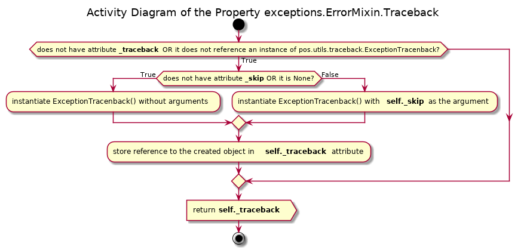
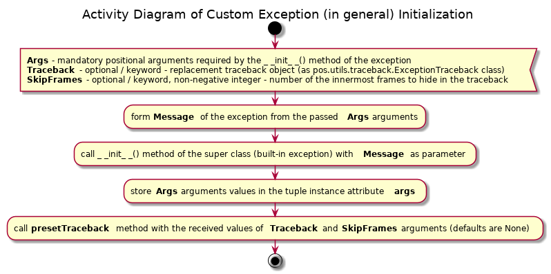
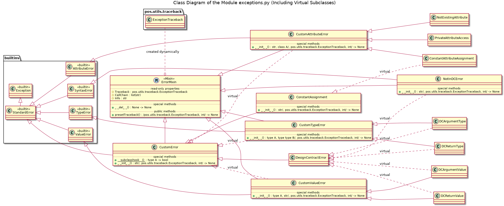

# UD002 Module pos.exceptions Reference

## Scope

This document provides reference information on the module _**exceptions**_ within the library **pos**. In this module the custom exception classes are defined. These custom exceptions are closely integrated within the tree of the standard exceptions, in fact, depending on the situation when they are intended to be raised, they are organized in terms of the super class – subclass relations as branches originating from the standard exception classes **TypeError**, **ValueError**, **AttributeError**, etc. Unlike the standard exceptions, they provide the built-in traceback inspection functionality. When intercept in the except branch of the **try...except** construct, the call chain can be obtained as a list of strings – the fully qualified names of the callers, as well as the full traceback’s frame record in the human-readable form including the extracts from the source code.

## Intended Use and Functionality

The basic idea is to separate the situations when an exception is raised intentionally in response to the wrong or unexpected input or generated output data or clear violation of the new functionality implemented in this library (like attempt to access a ‘private’ attribute or change the value of a constant / ‘protected’ attribute) from those situations, when an exception is raised by the interpreter itself, as in the case of a wrong code. The group of the exceptions in the most case is better left not handled, otherwise some errors in the code can never be found. The first group however, in many cases can be meaningfully handled without breaking of the process flow.

Since these custom exceptions are likely to be caught and handled in the majority of the situations it is important to be able to obtain the exception traceback for the analysis and decision making without letting the exception propagate all the way back to the interpreter’s loop top level.

On the other hand, in some situations the custom defined exceptions may be treated in the same context as the system generated of the same or similar meaning, e.g. custom type-related exceptions and the standard **TypeError**.

Thus the three functional (major) requirements for the custom exceptions:

* The custom exceptions must be closely integrated with the standard exceptions of the similar meaning, e.g. the standard **TypeError** could be used to catch the system generated as well as the custom type-related exceptions raised on purpose
* The custom defined exceptions must be clearly distinguishable form the system generated standard errors, e.g. being able to catch any custom type-related exception but not the standard **TypeError**, and, in broader sense, any custom defined exception but not any of the standard exceptions
* When being caught the custom exception should provide the call chain as a list of fully qualified names of the callers as well as human-readable string representation of the entire traceback of the call frames from the frame where an exception is being handled to the frame where it has been raised

By their intended use, i.e. the situations when they are supposed to be raised, there have been identified the need for 14 custom exceptions:

* **CustomError** – a generic error to be raised mostly for the debugging purposes or re-raised for the generalization purposes as a part of another (more specific) exception handling, but it can also serve as an ‘umbrella’ case to catch any custom exception; must sub-class StandardError
* **ConstantAssignment** – a response to an attempted deletion or modification of an object considered to be constant, can also be used to catch a more specific **ConstantAttributeAssignment** exception, sub-class of the **CustomError**
* **DesignContractError** – a generic response for a violation of the Design by Contract restrictions, mostly intended as an ‘umbrella’ for catching or re-raising of the DbC related exceptions **DCArgumentType**, **DCArgumentValue**, **DCReturnType**, **DCReturnValue** and **NotInDCError**, or faults in the description of a contract, sub-class of the **CustomError**
* **NotInDCError** – a response to the situation when a function or method is taken under the Design by Contract control, but there is no actual contract for it
* **CustomAttributeError** – a generic, ‘umbrella’ exception for the situations related to the attribute access violations forced by the new functionality implemented in this library, subclass of **AttributeError**
* **ConstantAttributeAssignment** – a response to an attempt of modification or deletion of an attribute considered to be ‘constant’, sub-class of the **CustomAttributeError**
* **NotExistingAttribute** – a response to an attempted access (read, write or delete) to a non-existing attribute, sub-class of **CustomAttributeError**
* **PrivateAttributeAccess** – a response to an attempted access (read, write or delete) to an attribute considered to be ‘private’ / ‘hidden’, subclass of **CustomAttributeError**
* **CustomTypeError** – any situation related to unexpected / wrong type of the received (input) or generated (output) data, e.g. a string instead of expected / required integer, subclass of **TypeError**
* **DCArgumentType** – specific case of **CustomTypeError** (and subclass) to be raised by the DbC related objects if any of the arguments passed into a controlled function / method doesn’t satisfy the type limitations implied by the contract
* **DCReturnType** – specific case of **CustomTypeError** (and subclass) to be raised by the DbC related objects if the returned value of a controlled function / method doesn’t satisfy the type limitations implied by the contract
* **CustomValueError** – any situation related to unexpected / wrong value of the received (input) or generated (output) data, e.g. a negative value instead of expected / required positive value, subclass of **ValueError**
* **DCArgumentValue** – specific case of **CustomValueError** (and subclass) to be raised by the DbC related objects if any of the arguments passed into a controlled function / method doesn’t satisfy the value limitations implied by the contract
* **DCReturnValue** – specific case of **CustomValueError** (and subclass) to be raised by the DbC related objects if the returned value of a controlled function / method doesn’t satisfy the type limitations implied by the contract

The direct (parent – child) and indirect (grand-parent – grand-child, etc.) super class – subclass relations do not cover all required ‘umbrella’ exception cases. The problem is solved by registering some classes as *virtual subclasses* of another not directly related classes and by the ‘HAS A’ check as compliment to the standard ‘IS A’ relational check. With these additions the complete relation between the standard and custom exceptions is given in [Illustration 1](#ill1) below. The custom exception classes forming real super class – sub-class relations are given in **bold** with a star symbol, the *virtual subclass* relations are indicated in *italic* with a link symbol.

<a id="ill1">Illustration 1</a>


In terms of API the custom exceptions differ from the standard exceptions but not drastically:

* The initialization method, which is called when an exception is raised, requires one or two mandatory arguments (depending on a specific class), which are later stored in the attribute **args** of the created exception instance and are used to form the value of the attribute **message** – both attributes are present in the standard exception instances as well
* Each instance of a custom exception has 3 new properties, which are not present in the standard exception classes:
  - **CallChain** – a list of string, which represents the call chain with the fully qualified callers names
  - **Info** – a string, which represents the traceback of the frame record, and for each frame the fully qualified name of the caller, the path to the module, the number of the line in code where the call is made and an extract from the source code are included
  - **Traceback** – an instance of the class **pos.utils.traceback.ExceptionTraceback**, which is responsible for the creation and analysis of the traceback; this property is intended to be use for specific purposes of the traceback substitution, etc., which can be handy in some situations, see examples later in the code

When raised a custom exception can be let to propagate all the way to the top level of the interpreter loops which results in the system traceback dump displayed in the console, exactly as any standard exception does. However, if it is caught in the **except** branch the added traceback analysis becomes very useful.

The simplest situation is when the handling of an exception is simply logging.

```python
try:
    #do some stuff
    some_critical_function()
except CustomError as err:
    print ‘{}: {}’.format(err.__class__.__name__, err.message)
```

**N.B.** due to the implementation of the standard exceptions the string representation of an exception (as **print err**) prints the content of its attribute **args**, not its attribute **message**, the same situation is with the console system traceback dump. The design decision has been made to left that scheme be and to stick with the usage of the attribute **message** instead, as in the example above.

One can retrieve, log or analyze the callers chain and make some handling decisions based on that chain, e.g.:

```python
try:
    #do some stuff
    some_critical_function()
except CustomError as err:
    print err.CallChain
```

One can even log the human-readable traceback of the call frame records with help of some **logger**:

```python
try:
    #do some stuff
    some_critical_function()
except CustomError as err:
    logger.error(err.Info)
```

Another example shows how to raise another exception (e.g. of more generic) as a part of the original exception handling preserving the message and traceback of the original exception. For instance, there are two critical functions, which can raise different but related exceptions, and the programmer wishes to leave the actual handling of this particular situation to some upper level part of the code, but to let other errors propagate as they are.

```python
try:
    #do some stuff
    some_critical_function() # May raise DCArgumentType
    some_other_critical_function() # May raise DCReturnValue
except (DCArgumentType, DCReturnValue) as err:
    raise DesignContractError(err.message, objTraceback = err.Traceback)
```

In some more advanced situations the programmer may wish to hide some innermost call frames in the traceback. For instance, to hide some implementation details like call to some generic helper function, which is not really relevant for the determination of the source of an error, and may even hinder the judgment by going too deep into the code. And the programmer wishes to re-raise the same type of the exception and avoid possible mismatch of the initialization methods signatures.

```python
try:
    #do some stuff
    some_critical_function()
except CustomError as err:
    #do some analysis of the err.CallChain
    #suppose, that we need 2 frames to delete from the tail
    raise err.__class__(*err.args, objTraceback = err.Traceback, iSkipFrames = 2)
```

The last situation / example illustrate the situation when a function, which raises an exception, instructs the removal of the last traceback frame upon raising of an exception without a substitute traceback object. Suppose that there are several functions, which all call some generic helper function, which actually raises an exception. In this situation for the analysis of the error it is more important to underline the call to an outer function, which resulted in an exception, rather than the helper function. So, an exception can be raised by the helper function with explicit indication, that the frame of this helper function must be removed from the traceback.

```python
def outer_function():
    #do some stuff
    inner_function(some_argument)

def inner_function(some_argument):
    if some_condition:
        raise CustomError(‘some message’, iSkipFrames = 1)
```

## Design and Implementation

The entire set of the custom exception is implemented as either direct sub-classes of some standard exception classes or as sub-trees / branches originating from some of the standard exception classes. Each custom exception class at the top of the sub-tree / branch as well as every stand-alone custom exception class is also mixed-in with the **ErrorMixin** class, which provides the traceback analysis functionality.

The **ErrorMIxin** class adds a ‘private’ instance attributes **_traceback** and **_skip** when they are needed and implements the properties **Traceback**, **CallChain** and **Info** as well as the public method **presetTraceback**(). If created, the instance attribute **_traceback** stores a reference to an instance of the class **pos.utils.traceback.ExceptionTraceback**, whereas the attribute **_skip** – a positive integer as the number of traceback frames to hide.

Upon accessing the property **Traceback**, a check is made if a traceback is already retrieved and stored. If the traceback is already stored, it is simply returned. Otherwise, it is obtained by instantiation the **ExceptionTraceback** class and stored. If a valid number of the frames to delete is stored (positive integer) and it doesn’t exceed the length of the traceback, the required number of the innermost frames is deleted, otherwise this value is ignored. Afterwards the retrieved traceback is returned. Thus, the traceback is retrieved only upon request (traceback analysis functionality may never be used with this particular instance) and is retrieved only once (later calls use the cashed value), and it is not retrieved if a proper substitution object has been provided during instantiation of an exception.

The property **CallChain** is a syntax sugar / short-cut for **Traceback.CallChain**, the property **Info** simply adds a first line containing the name of the exception’s class and the exception’s message to the string returned by **Traceback.<span></span>Info**. Thus, regardless of which of these properties is called first, the traceback object is created if it doesn’t exist yet.

The method **presetTraceback**() can accept two optional arguments as positional or keyword arguments – the substitution traceback object and / or number of frames to remove. The number of frames, if provided, is analyzed first. If it is a positive integer, the instance attribute **_skip** is created and the value of this argument is stored in that attribute. Then, if the substitute traceback object is provided and it is an instance of the **ExceptionTraceback** class, the instance attribute **_traceback** is created and a new instance of the **ExceptionTraceback** class is stored (referenced by) in this attribute. If the number of the frames to remove is defined and it doesn’t exceed the length of the passed substitution object, only a slice of the traceback records is copied into the new object, otherwise the entire traceback record is copied.

The activity diagrams of the described properties and method are given in [Illustration 2](#ill2) to [Illustration 4](#ill4).

<a id="ill2">Illustration 2</a>



<a id="ill3">Illustration 3</a>

_Activity.png)

<a id="ill4">Illustration 4</a>

_Activity.png)

The initialization methods of the custom exceptions may require either a single mandatory argument or two mandatory arguments, depending on their intended usage. However, within a single sub-tree (closely related types of the exceptions) all exceptions have the same signature of the initialization method and the same format of the error message. Thus, the initialization methods are overloaded only for the ‘roots’ of the sub-trees, whereas their sub-classes simply inherit these overloaded methods. Additionally, optional arguments may be supplied either as positional or keyword arguments when required to provide a traceback substitution object and / or a number of the innermost frames to hide.

Thus, each overloaded initialization method forms a proper error message from the passed mandatory argument(s), which is passed as a single argument into the initialization method of their super class (standard exception). Then the passed mandatory arguments are stored directly as a tuple in the instance attribute **args**. And a call to the method **presetTraceback**() inherited from the **ErrorMixin** class is made with the values of the optional arguments (if provided) or their default values being passed as arguments. This is illustrated by the activity diagram in [Illustration 5](#ill5).

<a id="ill5">Illustration 5</a>



The read-only properties **Traceback**, **CallChain** and **Info** are also inherited from the mix-in class **ErrorMixin**. The real super class – subclass relation between the custom exception classes, **ErrorMixin** class and the standard exception classes is given in the class diagram in [Illustration 6](#ill6).

<a id="ill6">Illustration 6</a>

.png)

The **CustomError** class has **abc.ABC_Meta** as its meta-class. It defines a class method **\_\_subclasshook\_\_**(), which changes the behavior of the built-in function **issubclass**(). When the **CustomError** class is used as a reference type the calling type is considered to be its subclass if:

* the calling class is real direct or indirect subclass of **CustomError** OR
* the calling class is real direct or indirect subclass of the standard exception class **StandardError** AND it has attributes **Traceback**, **CallChain** and **Info** (combination of ‘IS A’ and ‘HAS A’ relation check)

Otherwise the standard relation resolution scheme is employed (see [Illustration 7](#ill7)). Thus, the classes **ConstantAssignment** and **DesignContractError** do inherit this method, but only the standard ‘IS A’ relation check scheme is applied when they are used as the reference types for the **issubclass**() check. On the other hand, they also inherit the **abc.ABC_Meta** as their meta-class. Therefore, any other class may be registered as their *virtual subclass* using the method **register**(). This method is indeed used to register the class **ConstantAttributeAssignment** as a virtual subclass of **ConstantAssignment**, and the classes **NotInDCError**, **DCArgumentType**, **DCArgumentValue**, **DCReturnType** and **DCReturnValue** are registered as the virtual subclasses of the class **DesignContractError**. The relation between the classes including the *virtual subclasses* is given in the class diagram in [Illustration 8](#ill8).

<a id="ill7">Illustration 7</a>

_Activity.png)

<a id="ill8">Illustration 8</a>



## API Reference

### Class ErrorMixin

Helper / mix-in class to add the traceback analysis functionality to the custom exception classes.

#### Instance Data Attributes

* **Traceback**: **pos.utils.traceback.ExceptionTraceback**, _**read-only property**_, an instance of the exception traceback object; if such traceback object has not been created yet, it is created upon the first call
* **CallChain**: list of strings, _**read-only property**_,  the exception’s callers chain, simply a short-cut for the same property of the internally stored traceback object, i.e. **ExceptionTraceback.CallChain**
* **Info**: string, _**read-only property**_,  the human-readable exception’s traceback frame records including per frame the fully qualified caller’s name, path to the corresponding module, the line number in the code where the call is made as well as an extract from the source code centered around the caller’s line; simply adds the exception’s class name and error message to the result return be the same property of the stored traceback object, i.e. **ExceptionTraceback.<span></span>Info**

#### Initialization

As a mix-in class, it is not supposed to be instantiated by itself.

#### Instance Methods

**presetTraceback**(objTraceback = None, iSkipFrames = None)

Signature:

/pos.utils.traceback.ExceptionTraceback, int/ -> None

Args:

* *objTraceback*: optional (keyword), a replacement traceback object as an instance of **pos.utils.traceback.ExceptionTraceback** class
* *iSkipFrames*: optional (keyword), the required number of the innermost call stack frames, must be a non-negative integer but not larger than the expected length of the traceback or the length of the replacement traceback object

Description:

Helper method to replace the internally stored traceback object and / or the number of the innermost call frames to hide. Intended to be used by the initialization methods of the custom exceptions. However, may also be used at any time to change the exception's traceback on the fly.

Warning: the second optional argument - number of frames to skip - has an effect only if the following conditions are met:
1. If ...
  - No calls to the properties Traceback, CallChain or Info are made yet since the instantiation / raise of the exception
  - OR a valid traceback object is provided as the first optional argument (with the keyword arguments call the order is not important)
2. The required number of the skipped frames is a non-negative integer
3. This number doesn't exceed the length of the traceback

### Custom Exception Classes

All defined custom exception have identical API except for the initialization method.

#### Instance Data Attributes

* **message**: string, the exception’s error message, formed upon initialization from the passed mandatory argument(s)
* **args**: tuple, the mandatory argument(s) passed into the initialization method
* **Traceback**: **pos.utils.traceback.ExceptionTraceback**, _**read-only property**_, an instance of the exception traceback object; if such traceback object has not been created yet, it is created upon the first call. Inherited from the **ErrorMixin**.
* **CallChain**: list of strings, _**read-only property**_,  the exception’s callers chain, simply a short-cut for the same property of the internally stored traceback object, i.e. **ExceptionTraceback.CallChain**. Inherited from the **ErrorMixin**.
* **Info**: string, _**read-only property**_,  the human-readable exception’s traceback frame records including per frame the fully qualified caller’s name, path to the corresponding module, the line number in the code where the call is made as well as an extract from the source code centered around the caller’s line; simply adds the exception’s class name and error message to the result return be the same property of the stored traceback object, i.e. **ExceptionTraceback.<span></span>Info**. Inherited from the **ErrorMixin**.

#### Instance Methods

**presetTraceback**(objTraceback = None, iSkipFrames = None)

Signature:

/pos.utils.traceback.ExceptionTraceback, int/ -> None

Args:

* *objTraceback*: optional (keyword), a replacement traceback object as an instance of **pos.utils.traceback.ExceptionTraceback** class
* *iSkipFrames*: optional (keyword), the required number of the innermost call stack frames, must be a non-negative integer but not larger than the expected length of the traceback or the length of the replacement traceback object

Description:

Inherited from the **ErrorMixin** class.

#### Initialization - classes CustomError, DesignContractError

**\_\_init\_\_**(strMessage, objTraceback = None, iSkipFrames = None)

Signature:

str/, pos.utils.traceback.ExceptionsTraceback, int/ → None

Args:

* *strMessage*: string, mandatory, the error message, supposed to be a string, but it is not checked
* *objTraceback*: optional (keyword), a replacement traceback object as an instance of pos.utils.traceback.ExceptionTraceback class
* *iSkipFrames*: optional (keyword), the required number of the innermost call stack frames, must be a non-negative integer but not larger than the expected length of the traceback or the length of the replacement traceback object

#### Initialization - class ConstantAssignment

**\_\_init\_\_**(strObject, objTraceback = None, iSkipFrames = None)

Signature:

str/, pos.utils.traceback.ExceptionsTraceback, int/ → None

Args:

* *strObject*: string, mandatory, the name of a ‘constant’ object, which value has been attempted to be modified or deleted, supposed to be a string, but it is not checked; it is used to form the error message
* *objTraceback*: optional (keyword), a replacement traceback object as an instance of pos.utils.traceback.ExceptionTraceback class
* *iSkipFrames*: optional (keyword), the required number of the innermost call stack frames, must be a non-negative integer but not larger than the expected length of the traceback or the length of the replacement traceback object

#### Initialization - classes CustomAttributeError, ConstantAttributeAssignment, PrivateAttributeAccess, NotExistingAttribute

**\_\_init\_\_**(strAtrr, clsType, objTraceback = None, iSkipFrames = None)

Signature:

str, class A/, pos.utils.traceback.ExceptionsTraceback, int/ → None

Args:

* *strAttr*: string, mandatory, the name of an attrbute to which the implemented access restrictions are violated, supposed to be a string, but it is not checked; it is used to form the error message
* *clsType*: mandatory, the reference to the ‘owner’ (of the attribute) class, supposed to be a class reference (as a type), but it is not checked; it is used to form the error message
* *objTraceback*: optional (keyword), a replacement traceback object as an instance of pos.utils.traceback.ExceptionTraceback class
* *iSkipFrames*: optional (keyword), the required number of the innermost call stack frames, must be a non-negative integer but not larger than the expected length of the traceback or the length of the replacement traceback object

#### Initialization - class NotInDCError

**\_\_init\_\_**(strObject, objTraceback = None, iSkipFrames = None)

Signature:

str/, pos.utils.traceback.ExceptionsTraceback, int/ → None

Args:

* *strObject*: string, mandatory, the name of an object, which is taken under the Design by Contract control, but the corresponding design is not found, supposed to be a string, but it is not checked; it is used to form the error message
* *objTraceback*: optional (keyword), a replacement traceback object as an instance of pos.utils.traceback.ExceptionTraceback class
* *iSkipFrames*: optional (keyword), the required number of the innermost call stack frames, must be a non-negative integer but not larger than the expected length of the traceback or the length of the replacement traceback object

#### Initialization - classes CustomTypeError, DCArgumentType, DCReturnType

**\_\_init\_\_**(gValue, clsType, objTraceback = None, iSkipFrames = None)

Signature:

type A, type type B/, pos.utils.traceback.ExceptionsTraceback, int/ → None

Args:

* *gValue*: mandatory, a value, which type doesn’t match an expected / required type; it is used to form the error message
* *clsType*: mandatory, supposedly the reference class / type, which was expected / required, but it is not checked; it is used to form the error message
* *objTraceback*: optional (keyword), a replacement traceback object as an instance of pos.utils.traceback.ExceptionTraceback class
* *iSkipFrames*: optional (keyword), the required number of the innermost call stack frames, must be a non-negative integer but not larger than the expected length of the traceback or the length of the replacement traceback object

#### Initialization - classes CustomValueError, DCArgumentValue, DCReturnValue

**\_\_init\_\_**(gValue, strError, objTraceback = None, iSkipFrames = None)

Signature:

type A, str/, pos.utils.traceback.ExceptionsTraceback, int/ → None

Args:

* *gValue*: mandatory, a value, which type doesn’t match an expected / required value restriction; it is used to form the error message
* *strError*: string, mandatory, an explanation on what kind of values restriction is violated, supposed to be a string, but it is not checked; it is used to form the error message
* *objTraceback*: optional (keyword), a replacement traceback object as an instance of pos.utils.traceback.ExceptionTraceback class
* *iSkipFrames*: optional (keyword), the required number of the innermost call stack frames, must be a non-negative integer but not larger than the expected length of the traceback or the length of the replacement traceback object