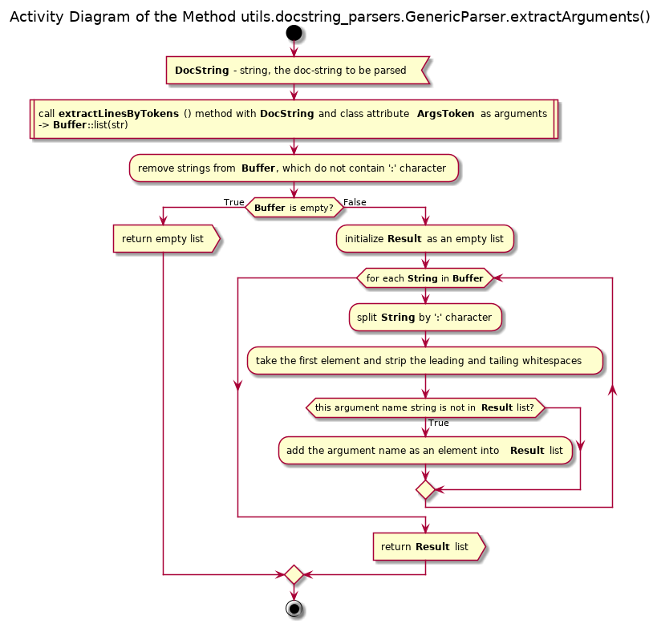

# UD003 Module pos.utils.docstring_parsers Reference

## Table of Content

* [Scope](#Scope)
* [Intended Use and Functionality](#Intended-Use-and-Functionality)
* [Design and Implementation](#Design-and-Implementation)
* [API Reference](#API-Reference)
  - [Class GenericParser](#Class-GenericParser)
  - [Class EpytextParser](#Class-EpytextParser)
  - [Class reSTParser](#Class-reSTParser)
  - [Class GoogleParser](#Class-GoogleParser)
  - [Class AAParser](#Class-AAParser)
  - [Class NumPydocParser](#Class-NumPydocParser)
  - [Functions](#Functions)
* [References](#References)

## Scope

This document provides reference information on the module **utils.docstring_parsers** within the library **pos**, wherein a set of classes is defined, which can either extract specific data related to the automatic documentation generation form the module’s, class’, method’s or function’s doc-string, or to produce a reduced version of the doc-string with all such data removed.

The four most widely used formats <a id="bref">[1 - 5](#ref)</a> for the auto-documentation are supported:

* [Epytext](http://epydoc.sourceforge.net/manual-epytext.html) (based on the javadoc format)
* [reST](https://thomas-cokelaer.info/tutorials/sphinx/docstring_python.html) (as reStructured Text format)
* [Google Python documentation format](https://github.com/google/styleguide/blob/gh-pages/pyguide.md#38-comments-and-docstrings), as well as the super-set of this format with additional tokens employed by the author of the library (Anton Azarov)
* [NumPydoc](https://numpydoc.readthedocs.io/en/latest/format.html#docstring-standard) format

The implemented classes are:

* **GenericParser**
  - **EpytextParser**
  - **reSTParser**
  - **GoogleParser**
    + **AAParser**
  - **NumPydocParser**

Two helper functions are defined as well:

* **guess_parser**(): returns the most appropriate parser class based on the efficiency of the auto-documentation data removal
* **indent_docstring**(): returns a “copy” of the original doc-string with all lines additionally indented by the same amount of spaces

## Intended Use and Functionality

The primary goal of this module is to provide functionality for the generation of the ‘pretty’ formatted textual information as the introspection of the “live” objects (as classes, their instances and attributes) from the doc-strings of the classes themselves as well as their methods and data descriptors.

The doc-strings are intended for the in-line documentation of the code, and they are useful during the analysis of the source code as well as during the introspection of the “live” objects, e.g. by using the built-in function **help**(). The absolute minimum of what they should do is to describe what a function / method / class does. Since Python is a dynamic binding programming language, the definition of a function / method fixes only the number and order of the parameters, but not their types. Furthermore, the function / method definition does not define the return value(s) type. In short, unlike the static programming languages, the function / method definition does not define its *signature*.

Often it is useful to provide information on the meaning, types and / or values range of the arguments, that are expected as the input (regardless of how the ‘wrong’ input is treated), as well as of the returned value(s), and the types of the exceptions, which can be raised, and in which situations they are raised. Such information is, usually, nothing more than ‘hints’ for the user, unless the strict data sanity checks are implemented (e.g. using Design by Contract approach). However, such information is expected to be present in the ‘good’ code. Moreover, there are plenty of tool for the automatic documentation generation, which expect that information in the docstrings in one of the common formats (see above).

On the other hand, inclusion of such information into the docstrings greatly increases the volume of the docstring, and the output of the built-in function **help**() becomes really bloated, especially when a class or its instance is inspected.

The solution within **pos** library is to implement the modified introspection functionality within the most base ABC, which is inherited by all other classes derived from it. With this solution the actual doc-strings of a class and its methods are stripped of all auto-documentation related lines, when a class or its instance is inspected, but the method’s signature, names of the arguments, returned value(s) type and possible exceptions and contract (if available) are added to the description of the method / data descriptor. This approach results in more compact yet more detailed output than the built-in function **help**(), which also has the same ‘look’ regardless of the actual format of the auto-documentation employed within the doc-string.

When a method / data descriptor of a class / instance is introspected, its docstring is shown mostly as it is (except for, possibly, the indentation and the leading / tailing empty lines), whereas additional information on the arguments names and order is to be provided.

The secondary goal of the module is to provide means for the “off-line” automated documentation generation (without importing the modules into the interpreter’s environment, i.e. based on the analysis of the source code only) regardless of the actual format of the auto-documentation used.

Thus, the required functionality of the module includes:

* Ability to ‘beautify’ a docstring, i.e. to remove all leading and tailing empty lines, to remove all tailing whitespaces in each line, and to increase or decrease the indentation of all remaining lines uniformly
* Ability to choose the most appropriate parser class based on the format of the auto-documentation used
* Ability to remove as much as possible (ideally, all) auto-documentation related lines from a docstring
* Ability to remove the doc-test related lines
* Ability to extract ‘hints’ from the doc-string concerning:
  - names and order of the expected arguments (parameters) of the function / method
  - type(s) of the value(s) returned by the function / method
  - types of the exceptions, which can be raised by the function / method
  - explicitly defined signature of the function / method (currently, only for the Google’s format super-set used by AA)

The intended use cases of the module are shown in [Illustration 1](#ill1).

<a id="ill1">Illustration 1</a>

This functionality is implemented according the following logic:

* The auto-documentation related lines are recognized by format-specific tokens
* The token must be the first non-whitespaces sub-string of the line (residual indentation is ignored)
* The token defines the start of a text block: one or several lines – whereas the end of the text block is identified either by an empty line (ignoring the indentation) or by another token. **N.B.** the official Google Python documentation format allows inclusion of several paragraphs within a single auto-documentation entry, since it also relies on the indentation. The current implementation does not support the inclusion of the empty line separated paragraphs! Any empty line automatically ends the entry.
* The token may be followed by the text on the same line, or the explanatory / data text can start from the next line (usually, with the additional indentation)
* In the case of the NumPydoc the actual token (as a word / words) must be underlined with the ‘-’ (minus sign), thus the next line must starts with at least one ‘-’ character (ignoring the indentation); the first two lines of the block are considered as a single token, whereas the actual text must begin at the 3rd line

## Design and Implementation

The doc-string parsers for the specific formats are implemented as the specialized sub-classes of a generic prototype class, with all classes being intended to be used without instantiation (a la Singleton), since all their methods are class methods. The prototype class implements all methods generically based on the class data attributes, whereas the specialized sub-classes are supposed to redefine the class data attributes (as static fields) according to specific tokens of their doc-style format. However, in some cases, the sub-classes override the generic implementation of some methods in order to account for peculiarities of a specific doc-style format.

These class fields are:

* **SkipTokens** – a list of strings, all recognized tokens of a specific doc-style format. **N.B.** this field must be a sequence of strings within any class; other fields may be of None value (ignored), a string or a sequence of strings (if there are multiple tokens of the same or close meaning)
* **SecondLineSymbol** – None or  string (may be a single or multiple characters); relevant only for the formats, where an actual token occupies two lines (e.g. NumPydoc, where a token is underlined by ‘-’ (minus characters)), and the actual data starts from the third line. The implementation assumes that all tokens have the second line, which starts from this / these symbol(s) ignoring the indentation, and it does not check the length of the second line of the token. This implementation is ok for the NumPydoc doc-style format, whereas the rest of the implemented formats have this field at the None value.
* **SignatureToken** – None or a string (only for AA doc-style), the token, which designates explicit definition of the function / method signature
* **ArgsToken** – None, string or list of strings, the token(s) that designate(s) the names of the function / method arguments and their types or explanation notes
* **ReturnTokens** – None, string or a list of strings, the token(s) that designate(s) the type of the returned value(s) with the optional explanatory notes, but not only the explanatory notes (see tokens **:return** (explanation) and **:rtype** (type) of the reST format)
* **RaisesTokens** – None, string or a list of strings, the token(s) that designate(s) the names (class / type) of the exceptions, that can be raised by the function / method, with the optional explanatory notes

All classes have the following class methods:

* **trimDocstring(strDocstring) : str → str** – removes the excessive indentation, leading and tailing empty lines, and the tailing whitespaces in each line
* **reduceDocstring(strDocstring): str → str** – trims the docstring as above and removes all lines containing the documentation auto-generation related data, i.e. using all recognized tokens, see class field **SkipTokens**
* **extractLinesByTokens(strDocstring, Tokens): str, str OR seq(str) OR None → list(str)** – trims the docstings as above and returns all lines containing the documentation auto-generation related data related to the tokens listed in **Tokens**. Unlike the previous two methods, the returned lines are not joined into a single string (with the new-line separators) but are returned as a list of single-line strings.
* **extractSignature(strDocstring): str → str OR None** – attempts to extract the explicit definition of the function / method signature (AA doc-style, using the **Signature** token) or to deduce it from the extracted from the doc-string names of the arguments, their types and the type of the returned value(s) (for the reST format). The returned string (if found / deduced) is always a single line, even if the original signature occupies multiple lines. If not found / deduced, the returned values is None. For other formats (except AA and reST) the returned values is always None.
* **extractArguments(strDocstring): str → list(str)** – returns a list of unique names of the function / method arguments ordered by their appearance in the docstring using all tokens mentioned in the class field **ArgsToken**. Returns an empty list if no such names are found.
* **extractReturnedValues(strDocstring): str → list(str)** – returns a list of all found types of the value(s) returned by the function / method ordered by their appearance in the docstring using all tokens mentioned in the class field **ReturnTokens**. Uniqueness check is not performed. Returns an empty list if no such values are found.
* **extractRaises(strDocstring): str → list(str)** – returns a list of all found types (classes) of the exceptions, which can be raised by the function / method ordered by their appearance in the docstring using all tokens mentioned in the class field **RaisesTokens**. Uniqueness check is not performed. Returns an empty list if no such values are found.

Note that the correctness of the performance of these methods is not guaranteed unless the docstring format strictly complies with the specification of the given doc-style.

The class diagram of the module is given in [Illustration 2](#ill2).

<a id="ill2">Illustration 2</a>

Apart from these classes two helpful functions are implemented:

* **guess_docstyle(strDocstring): str → `GenericParser** - ‘guesses’ the doc-style format employed within the passed docstring and returns the corresponding specific parser (class) by checking which of the parsers **AAParser**, **reSTParser**, **EpytextParser**, **NumPydocParser** is able to remove the greatest number of the auto-documentation lines; if none of them is able to reduce the doc-string, the default **AAParser** class is returned.
* **indent_docstring(strDocString, iTab = 1): str/, int >= 0/ → str** – adds the same amount of spaces to each line of the passed doc-string, with the required additional indentation being given in the number of ‘tabs’ (integer, >=0) and a single ‘tab’ being equal to 4 spaces.

The activity diagrams of these methods and functions are given in [Illustration 3](#ill3) to [Illustration 14](#ill14).

<a id="ill3">Illustration 3</a>

<a id="ill4">Illustration 4</a>

<a id="ill5">Illustration 5</a>

<a id="ill6">Illustration 6</a>

<a id="ill7">Illustration 7</a>

<a id="ill8">Illustration 8</a>

<a id="ill9">Illustration 9</a>

The class **GenericParser** is the prototype, and it is quite useless otherwise. The only recognized token is ‘>>>’, thus it can only remove the doc-test related lines; whereas all __extract*__() methods do nothing usefull.

The class **EpytextParser** does not override any of the inherited methods (uses the generic implementation), but it redefines the class fields. The specifics of the Epytext / Epydoc format are:

* Arguments of the function / method can be defined only by the token ‘@param’, which must be followed by the name of the argument, a colon (‘:’) and the type(s) / values / description of the argument.
* The returned type(s) can be defined only the token ‘@return:’ followed by the type or enumeration of types (preferably with comma (‘,’) separation). If an explanation is given, it must be on the same line, fit into one line and be separated from the previous text by a colon (‘:’)
* The possibly raised exceptions can be defined any of the tokens ‘@raise’, ‘@exception’ or ‘@throws’ followed by the name (type / class) of the exception and a colon (‘:’). If an explanation is given, it must be on the same line, fit into one line and be placed after this colon.
* The extractSignature() method for this format always returns None.

The class **reSTParser** redefines the class fields and overrides the method **extractSignature**(), the rest of the methods are simply inherited. The specifics of this format are:

* The arguments’ definitions are recognized by the tokens ‘:param’, ‘:parameter’, ‘:arg’, ‘:argument’, ‘:key’, ‘:keyword’ and ‘:type’ - followed by the name of the argument, a colon (‘:’) and the explanatory text. Note that the token ‘:type’ defines the expected type of the argument (or an enumeration of thereof, preferably with ‘,’ separation), whereas other tokens must refer to an explanation, with the token ‘:param’ being preferable. Thus, it is possible that the same argument’s name can be encountered twice, but the method **extractArguments**() guarantees that each name appears only once in the result of the method.
* The returned type(s) can be defined only the token ‘:rtype:’ followed by the type or enumeration of types (preferably with comma (‘,’) separation). Note that for the explanatory notes other tokens must be used - ‘:returns’ or ‘:return:’ - which are simply ignored by the method **extractReturnedValues**()
* The possibly raised exceptions can be defined any of the tokens ‘:raises’, ‘:raise’, ‘:except’ or ‘:exception’ followed by the name (type / class) of the exception and a colon (‘:’). If an explanation is given, it must be on the same line, fit into one line and be placed after this colon.
* The **extractSignature**() method tries to deduce the function / method signature based on the list of the arguments names extracted from the doc-string, the list of the extracted return type(s) and found lines with the ‘:type’ token. If an argument in the list of the arguments has the corresponding ‘:type’ line within the doc-string, the sub-string between the ‘:type’ token and the first colon (‘:’) after it is used as the argument type; otherwise the ‘type A’ value is substituted. If the returned type(s) list is empty, the ‘type A’ value is substituted as the returned type. See [Illustration 10](#ill10).

<a id="ill10">Illustration 10</a>

The class **GoogleParser** does not override any of the inherited methods (uses the generic implementation), but it redefines the class fields. The specifics of the Google Python doc-style format are:

* The data text must begin on the next line after the token, and it must be indented with respect to the token – this requirement is not obligatory with the current implementation, since the end of the token’s text is defined by occurrence of an empty line or another token
* Arguments of the function / method can be defined only by the token ‘Args:’, which must be followed by the name of the argument, a colon (‘:’) and the type(s) / values / description of the argument.
* The returned type(s) can be defined by either ‘Returns:’ or ‘Yields:’ token followed by the type or enumeration of types (preferably with comma (‘,’) separation). If an explanation is given, it must be on the same line, fit into one line and be separated from the previous text by a colon (‘:’)
* The possibly raised exceptions can be defined only by the token ‘Raises:’ followed by the name (type / class) of the exception and a colon (‘:’). If an explanation is given, it must be on the same line, fit into one line and be placed after this colon.
* The **extractSignature**() method for this format always returns None.

The doc-style adopted by the author (AA) is a superset of the Google Python doc-style with extra tokens, mostly concerning the docstrings of the objects ‘higher’ than functions / methods: classes, modules, packages and libraries. In the case of the function / method docstring the differences with the official Google style are the explicit signature definition by the token ‘Signature:’ and the automatic recognition of the optional arguments’ definition. Basically, the format requirements / specifics are the same as of the official Google format, with just but two differences:

* If the name of the argument (and mandatory colon after it) is directly followed by the ‘(optional)’ token, the name of the argument in the returned list is escaped by ‘/’ characters, indicating its optional nature. Therefore, the method **extractArguments**() is overridden, see [Illustration 11](#ill11).
* The **extractSignature**() method returns the explicitly defined signature (token ‘Signature:’) as a single line string, or None if such definition is not found, using the generic implementation of the method **extractSignature**() inherited from the **GenericParser** class.

<a id="ill11">Illustration 11</a>

The class **NumPydocParser** implements the NumPydoc doc-style format, which has the following specifics:

* Each token must be underlined with the ‘-’ (minus) signs, thus constituting the second line of the same length as the token itself. The data text must begin on the next line after that (i.e. on the third line), and it must be indented with respect to the token. Note, that the current implementation of the parser only checks that the second line of the token starts with the ‘-’ sign (ignoring the indentation), but it does not check the length of that line.
* Arguments of the function / method can be defined either the token ‘Parameters’ or ‘Other parameters’, which indicates the start of the data block. All arguments must be defined within this block. The description of each argument must begin with its name and the colon (‘:’), followed by the type(s) / values / description of the argument. If such description doesn’t fit into a single line, each next line of the same argument’s description must be indented with respect to the first line of the description text of this argument.
* The returned type(s) can be defined by either ‘Returns’ or ‘Yields’ token. The type or enumeration of types (preferably with comma (‘,’) separation) must be placed on the new line just after the underlining of the token. The explanation text must be on the next line and indented with respect to the type’s line. See [Illustration 12](#ill12)
* The possibly raised exceptions can be defined either by the token ‘Raises’ or ‘Warns’. Note that the token ‘Warnings’ is used for the warning comments / explanation for the users, rather than for the description of the possible exceptions, therefore this token is ignored. All possible exceptions must be described within a single such data block. The type / class of the exception must be placed on the new line just after the underlining of the token, or the previous exception description sub-block. The explanation text must be on the next line and indented with respect to the type’s line. See [Illustration 13](#ill13)
* The **extractSignature**() method for this format always returns None.

<a id="ill12">Illustration 12</a>

<a id="ill13">Illustration 13</a>

<a id="ill14">Illustration 14</a>

## API Reference

### Class GenericParser

Prototype class for the docstrings parsing. Implements all required class methods generically. The specific format parsers as subclasses of this prototype must change the class attributes defining the tokens according to their specific format. As a prototype, only the doc-test lines removal is supported.

Designed to be used without instantiation, since all methods are class methods.

#### Class Data Attributes (Fields)

* **SkipTokens**: list(str) = [‘>>>’]
* **SecondLineToken**: None
* **SignatureToken**: None
* **ArgsToken**: None
* **ReturnTokens**: None
* **RaisesTokens**: None

#### Class Methods

**trimDocstring**(strDocstring)

Signature:

str → str

Raises:

* *pos.exceptions.CustomTypeError*: input is not a string
* *pos.exceptions.CustomValueError*: input string contains only the whitespace characters (including tabs and new lines) or is empty

Description:

Beautifies the docstring by expanding the tabs into 4 whitespaces, removing the excessive indentation, tailing whitespaces, and the empty first and tailing lines if they are empty.

**reduceDocstring**(strDostring)

Signature:

str → str

Raises:

* *pos.exceptions.CustomTypeError*: input is not a string
* *pos.exceptions.CustomValueError*: input string contains only the whitespace characters (including tabs and new lines) or is empty

Description:

First beautifies the passed docstring using class method **trimDocstring**() and then removes all documentation auto-generation related information according to the format specifications.

**extractLinesByToken**(strDocstring, Tokens)

Siagnature:

str, str OR seq(str) OR None → list(str)

Raises:

* *pos.exceptions.CustomTypeError*: the first argument is not a string
* *pos.exceptions.CustomValueError*: input docstring contains only the whitespace characters (including tabs and new lines) or is empty
* *TypeError*: the second argument is neither None, nor string, nor a sequence of strings

Description:

Extracts the lines from the docstring, which are part of the documentation auto-generation for the specified token(s). The tokens themselves are removed.

**extractSignature**(strDocstring)

Signature:

str → str OR None

Raises:

* *pos.exceptions.CustomTypeError*: input is not a string
* *pos.exceptions.CustomValueError*: input string contains only the whitespace characters (including tabs and new lines) or is empty

Description:

Attempts to extract the explicit definition of a method's or function's signature from its docstring. Returns None if such information is not found within a proper docstring.

**extractArguments**(strDocstring)

Signature:

str → list(str)

Raises:

* *pos.exceptions.CustomTypeError*: input is not a string
* *pos.exceptions.CustomValueError*: input string contains only the whitespace characters (including tabs and new lines) or is empty

Description:

Attempts to extract the names of the arguments of  a method or function from its docstring. Returns an empty list if such information is not found within a proper docstring.

**extractReturnedValues**(strDocstring)

Signature:

str → list(str)

Raises:

* *pos.exceptions.CustomTypeError*: input is not a string
* *pos.exceptions.CustomValueError*: input string contains only the whitespace characters (including tabs and new lines) or is empty

Description:

Attempts to extract the names of the types of the returned values of a method or function from its docstring. Returns an empty list if such information is not found within a proper docstring.

**extractRaises**(strDocstring)

Signature:

str → list(str)

Raises:

* *pos.exceptions.CustomTypeError*: input is not a string
* *pos.exceptions.CustomValueError*: input string contains only the whitespace characters (including tabs and new lines) or is empty

Description:

Attempts to extract the names of the arguments of  a method or function from its docstring. Returns an empty list if such information is not found within a proper docstring.

### Class EpytextParser

Epytext format docstring parser. Subclass of **GenericParser**. Supports the removal of the doctest lines.

Designed to be used without instantiation, since all methods are class methods.

#### Class Data Attributes (Fields)

* **SkipTokens**: list(str) = ['@param', '@return:', '@raise', '@author', '@version', '@exception', '@throws', '@see', '@since', '@serial', '@serialField', '@serialData', '@deprecated', '>>>']
* **SecondLineToken**: None
* **SignatureToken**: None
* **ArgsToken**: str = '@param'
* **ReturnTokens**: str = '@return:'
* **RaisesTokens**: list(str) = [‘@raise’, ‘@exception’, ‘@throws’]

#### Class Methods

Inherits all class methods for the super class **GenericParser**.

### Class reSTParser

reST format (reStructured Text) docstring parser. Subclass of **GenericParser**. Supports the removal of the doctest lines.

Designed to be used without instantiation, since all methods are class methods.

#### Class Data Attributes (Fields)

* **SkipTokens**: list(str) = [':param', ':parameter', ':arg', ':argument', ':key', ':keyword', ':type',':returns:', ':return:', ':rtype:', ':raises', ':raise', ':except', ':exception', ':var', ':ivar', ':cvar', ':Example:', '>>>', '.. seealso::', '.. warning::', '.. note::', '.. todo::', '.. automodule::', ':members:', ':undoc-members:', ':inherited-members:', ':show-inheritance:']
* **SecondLineToken**: None
* **SignatureToken**: None
* **ArgsToken**: list(str) = [':param', ':parameter', ':arg', ':argument', ':key', ':keyword', ':type']
* **ReturnTokens**: str = ':rtype'
* **RaisesTokens**: list(str) = [':raises', ':raise', ':except', ':exception']

#### Class Methods

Inherits all class methods for the super class **GenericParser**, and overrides the method **extractSignature**() but preserves its signature.

### Class GoogleParser

Google recommended format docstring parser. Subclass of **GenericParser**. Supports the removal of the doctest lines.

Designed to be used without instantiation, since all methods are class methods.

#### Class Data Attributes (Fields)

* **SkipTokens**: list(str) = ['Args:', 'Returns:', 'Raises:', 'Attributes:', 'Note:', 'Yields:', 'Todo:', 'Example:','Examples:', '>>>']
* **SecondLineToken**: None
* **SignatureToken**: None
* **ArgsToken**: str = 'Args:'
* **ReturnTokens**: list(str) = [‘Returns:’, ‘Yields:’]
* **RaisesTokens**: str = ‘Raises:’

#### Class Methods

Inherits all class methods for the super class **GenericParser**.

### Class AAParser

Superset of the Google recommended format docstring parser with extra tokens. Subclass of **GoogleParser** -|> **GenericParser**. Supports the removal of the doctest lines.

Designed to be used without instantiation, since all methods are class methods.

#### Class Data Attributes (Fields)

* **SkipTokens**: list(str) = ['Args:', 'Returns:', 'Raises:', 'Attributes:', 'Note:', 'Yields:', 'Todo:', 'Example:','Examples:', '>>>', 'Signature:', 'Classes:', 'Properties:', 'Methods:', 'Class methods:', 'Read-only properties:', 'Functions:', 'Class attributes:', 'Packages:', 'Modules:']
* **SecondLineToken**: None
* **SignatureToken**: None
* **ArgsToken**: str = 'Args:'
* **ReturnTokens**: list(str) = [‘Returns:’, ‘Yields:’]
* **RaisesTokens**: str = ‘Raises:’

#### Class Methods

Inherits all class methods for the super class **GoogleParser** -|> **GenericParser**. Overrides the method **extractArguments**() but preserves its signature.

### Class NumPydocParser

NumPydoc format docstring parser. Subclass of **GenericParser**. N.B. does not support the removal of the doctest lines if they are not preceded by either of the tokens 'Usage' or 'Examples'; there should be no empty lines in the entire section.

Designed to be used without instantiation, since all methods are class methods.

#### Class Data Attributes (Fields)

* **SkipTokens**: list(str) = ['Parameters', 'Returns', 'Raises', 'Usage', 'Examples', 'Yields', 'See Also', 'Attributes', 'Other Parameters', 'Warns', 'Warnings']
* **SecondLineToken**: str = ‘-’
* **SignatureToken**: None
* **ArgsToken**: list(str) = ['Parameters', 'Other Parameters']
* **ReturnTokens**: list(str) = ['Returns', 'Yields']
* **RaisesTokens**: list(str) = ['Raises', 'Warns']

#### Class Methods

Inherits all class methods for the super class **GenericParser**. Overrides the methods **extractReturnedValues**() and **extractRaises**() but preserves their signatures.

### Functions

**guess_docstyle**(strDocstring)

Signature:

str → class `GenericParser

Raises:

* *pos.exceptions.CustomTypeError*: input is not a string
* *pos.exceptions.CustomValueError*: input string contains only the whitespace characters (including tabs and new lines) or is empty

Description:

Returns the best suited docstring parser for the given docstring based on its ability to effectively remove the lines related to the auto-generation of the documentation. The parsers are tried in the following order of preference: **AAParser** (as superset of **GoogleParser**), **reSTParser** (recommended by PEP287 format), **EpytextParser** (similar to popular javadoc format) and **NumPydocParser**. If neither of these parsers is able to remove any of the such lines (or they are simply not present in the docstring), the default **AAParser** class is returned.

**indent_docstring**(strDocstring, iTabs = 1)

Signature:

str/, int >= 0/ -> str

Args:

* *strDocstring*: string, the data to be processed
* *iTabs*: (optional) non negative integer, amount of 'tabs' to be inserted into the beginning of each line (each 'tab' is replaced by 4 space characters); default value is 1 (-> 4 spaces)

Raises:

* *pos.exceptions.CustomTypeError*: the first argument is not a string, or the second argument is not an integer
* *pos.exceptions.CustomValueError*: the first argument is an empty string, or the second argument is a negative integer

Description:

Prepends each line in the passed docstring (may be already trimmed) with the 4 times the specified number (second, optional argument) number of spaces.

## References

<a id="ref">[1]</a> https://stackoverflow.com/questions/3898572/what-is-the-standard-python-docstring-format   [&#x2B0F;](#bref)

[2] http://epydoc.sourceforge.net/manual-epytext.html

[3] https://thomas-cokelaer.info/tutorials/sphinx/docstring_python.html

[4] https://github.com/google/styleguide/blob/gh-pages/pyguide.md#38-comments-and-docstrings

[5] https://numpydoc.readthedocs.io/en/latest/format.html#docstring-standard