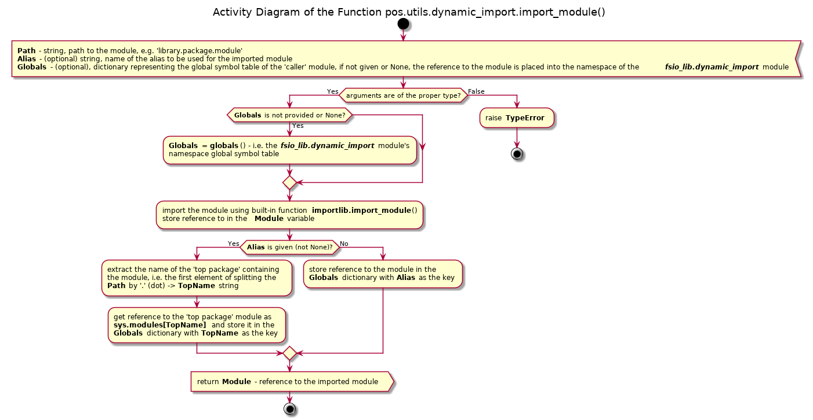
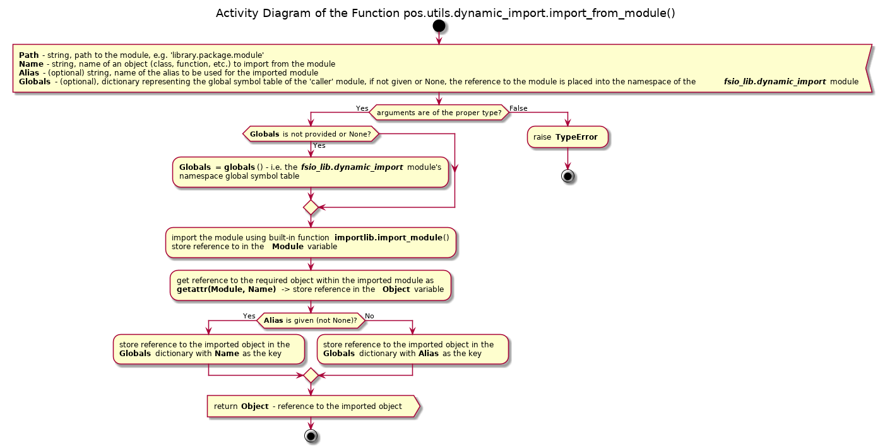

# UD004 Module pos.utils.dynamic_import Reference

## Table of Content

* [Scope](#Scope)
* [Intended Use and Functionality](#Intended-Use-and-Functionality)
* [Design and Implementation](#Design-and-Implementation)
* [API Reference](#API-Reference)
  - [Functions](#Functions)

## Scope

This document describes the design, intended usage, implementation details and API of the module utils.dynamic_import, which implements two functions for the dynamic import of the modules and separate objects respectively:

* **import_module**()
* **import_from_module**()

## Intended Use and Functionality

The purpose of this module is to provide the means for import of either an entire module or of a specific object from a module dynamically, i.e. ‘on demand’, at the runtime. The most demanded functionality is to import a specific class / object based on an entry (string name) in some configuration file.

The Standard Python Library provides ready solution – the module **importlib**, and the functions implemented within the module **utils.dynamic_import** are wrappers for easier use.

There are four principal import constructs:

* import some.module
* import some.module as alias
* from some.module import some_object
* from some.module import some_object as alias

The first two statements are designed for the import of the entire module into the current namespace, whereas the last two statements import only a single object from other module into the current namespace. “Under the hood”, however, the entire module is loaded into the interpreter’s environment as well as all other modules it imports itself, and, for the modules within packages, the ‘\_\_init\_\_.py’ modules of the corresponding ‘parent’ packages. The difference is only in which object is referenced in the globals table of the current namespace after the operation.

In the first case the top parent package containing the module is referenced in the globals table, e.g., if the module **some_module** is in the sub-package **sub_package** of the package **some_package**, i.e. **some_package.sub_package.some_module** – the reference to *some_package/\_\_init\_\_.py* module is created in the globals table under the name *some_package*. But the required module itself is accessible as (nested) attribute of the ‘module-type’ object **some_package** using dot-notation. If the module is ‘standing-alone’ (not a part of a package), the reference to the module itself is created in the global table using its original name as the reference name.

In the second case the reference to the required module is created always even if the module is a part of a package, but an *alias* is used as the reference’s name.

In the last two cases the reference to a specific object defined within the imported module is created in the globals table of the current namespace using either its original name or the provided *alias* as the name of the created reference.

In all four cases the required module itself is accessible directly via reference stored in the dictionary **sys.modules**.

The Standard Python Library **importlib.import_module**() imports a module into the interpreter’s environment (and all other related / required modules), creates a reference to it in the **sys.modules** dictionary, and returns this reference (to the module).

The functions implemented within the module **utils.dynamic_import** call the **importlib.import_module**() function to import a module into the interpreter’s environment, and add reference to the module or the requested object within that module into the passed dictionary, which is, usually, supposed to be the global names table, and return the reference to the imported module or object. Such functionality is convenient when several modules / objects are to be imported on the basis of some configuration file, e.g. file / data parsers, and the workflow of a program is supposed to switch between such object depending on the input data.

## Design and Implementation

The function **import_module**() operates as shown in [Illustration 1](#ill1):

* the sanity checks is performed on the input arguments; the **pos.exceptions.CustomTypeError** exception is raised if any of the provided arguments is of the wrong type
* the required module with all its dependencies is imported into the interpreter’s enviroment by means of the function **importlib.import_module**()
* If the ‘globals’ table (dictionary) is passed as the optional (keyword) argument, the reference will be created in that dictionary; otherwise the reference will be placed into the global names table of the module **pos.utils.dynamic_import**
* If alias is provided (as the optional argument) it is used as the name of the reference, which points to the module itself; otherwise the reference to the top parent package (the first name in the dot notation of the requested module) is created, using the name of the top parent package as the reference’s name
* The reference to the imported module (returned by the **importlib.import_module**() function) is returned, regardless of the name and value of the reference created in the ‘globals’ table

<a id="ill1">Illustration 1</a>

The function **import_from_module**() operates as shown in [Illustration 2](#ill2):

* the sanity checks is performed on the input arguments; the **pos.exceptions.CustomTypeError** exception is raised if any of the provided arguments is of the wrong type
* the required module with all its dependencies is imported into the interpreter’s enviroment by means of the function **importlib.import_module**()
* the reference to the required object (defined within the imported module) is accessed using the built-in function **getattr**()
* If the ‘globals’ table (dictionary) is passed as the optional (keyword) argument, the reference will be created in that dictionary; otherwise the reference will be placed into the global names table of the module **pos.utils.dynamic_import**
* The reference to the ‘imported’ object is created in the ‘globals’ table using either its original name or the passed alias as the name of the reference
* The reference to the ‘imported’ object is returned

<a id="ill2">Illustration 2</a>

## API Reference

### Functions

**import_module**(strPath, strAlias = None, dictGlobals = None)

Signature:

str/, str, dict/ -> \_\_builtins\_\_.module

Args:

* *strPath*: string, path to a module, e.g. 'library.package.module'
* *strAlias*: (optional) string, alias to be assigned to the imported module
* *dictGlobals*: (optional) dictionary representing the global symbol table

Returns:

*\_\_builtins\_\_.module*: a reference to the imported module

Raises:

* *pos.exceptions.CustomTypeError*: passed path to the module is not a string; or passed alias is not a string or None;  or the passed global symbols table is not a dictionary or None
* *ImportError*: required module is not found

Description:

Dynamic import of a module, optionally, with aliasing of its name. In order to place the reference to the imported module into the global symbol table of the caller's module such table must be passed as the keyword argument '*dictGlobals*' or a the third positional argument; otherwise the reference to the module is placed into the global symbol table of the module **pos.utils.dynamic_import** itself.

**import_from_module**(strPath, strName, strAlias = None, dictGlobals = None)

Signature:

str, str/, str, dict/ -> type A

Args:

* *strPath*: string, path to a module, e.g. 'library.package.module'
* *strName*: name of an object defined in the module, e.g. 'SomeClass'
* *strAlias*: (optional) string, alias to be assigned to the imported object
* *dictGlobals*: (optional) dictionary representing the global symbol table

Returns:

*type A*: a reference to the imported object

Raises:

* *pos.exceptions.CustomTypeError*: passed path to the module is not a string; or passed name of the object is not a string; or the passed alias is not a string or None; or the passed global symbols table is not a dictionary or None
* *ImportError*: required module is not found
* *AttributeError*: required object is not found in the module

Description:

Dynamic import of an object from a module, optionally, with aliasing of its name. In order to place the reference to the imported object into the global symbol table of the caller's module such table must be passed as the keyword argument '*dictGlobals*' or a the fourth positional argument; otherwise the reference to the object is placed into the global symbol table of the module **pos.utils.dynamic_import** itself.