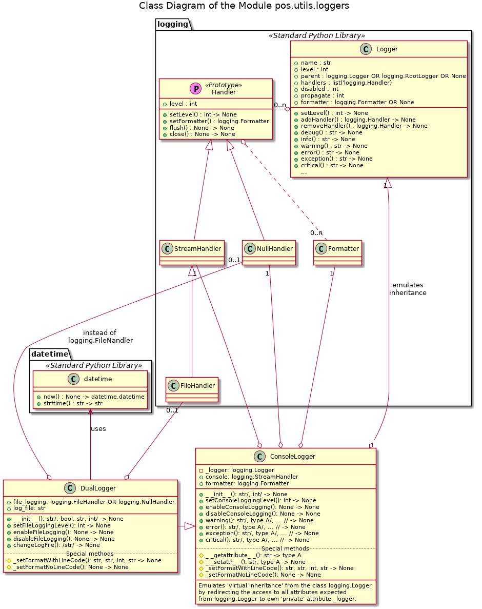
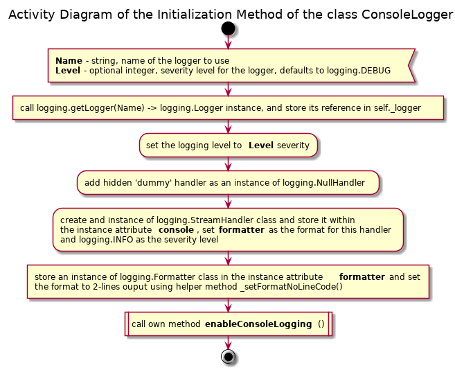
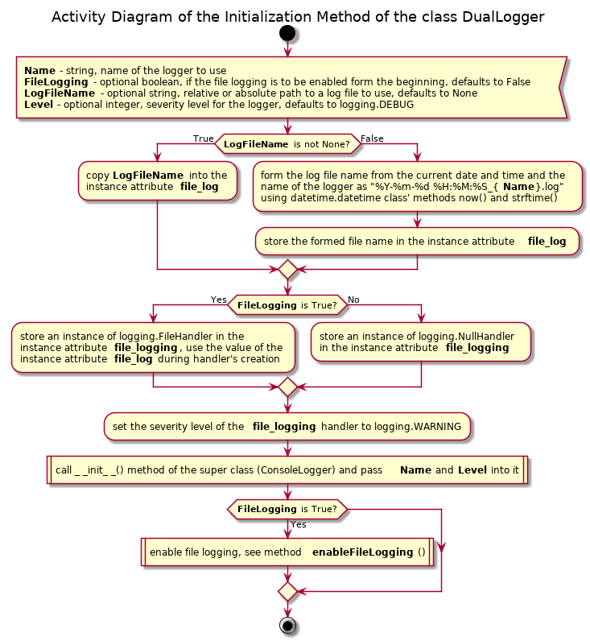

# UD005 Module pos.utils.loggers Reference

## Scope

This doucment describes the design, intended usage, implementation details and API of the module utils.loggers, which implements two custom loggers: to the console or to the console and / or a file (simultaneously).

* **ConsoleLogger**
  - **DualLogger**

## Intended Use and Functionality

This module is intended as an 'extension' of the functionality of the Standard Python Library **logging**. THe added functionality includes:

* built-in support for and simplified interface of a dual handler logger, which can log similtaneously into two separate streams: **stdout** (console) and a file
* ability to change the log file on demand ('on the fly') from a user, not just by reaching the threshold file size (as with the standard log file rotation scheme)
* ability to completely suppresse or enable output into one or both streams without changing the logging severity level of either the logger or the handler
* well defined and verbouse structure of the issued log entries

The dynamic disabling / (re-) enabling of the logging can be easily done with the standard loggers, as follows:

1. Obtain the current logging level of the handler to be suppressed and remember it
2. Set the corresponding handler at the highest level, i.e. to no output
3. Do some stuf, where the logging is to be suppressed
4. Restore the corresponding handler to the previously remembered logging level

The added functionality of the dynamic disabling / (re-) enabling of the logger output simply eliminates the necessity of obtaining, remembering and restoration of the handler's logging level, thus reducing the task to two instance methods without parameters.

For the rest, the functionality of these custom loggers should be the same as of the standard loggers:

* Each logger has a bound logging level, which can differ from the logging level(s) of its handlers, and which can be changed dynamically
* Each handler bound to a logger has its own logging level, which may differ from the logging level of the logger itself, and which can be changed dynamically
* A log entry can be issued by calling one of the methods of the logger: **info**(), **debug**(), **warning**() or **error**()
  - If the logging level of the logger is higher than the level of the issued entry, it is simply ignored by the logger
  - Otherwise, this entry is delivered to all handlers bound to this logger
    + If the logging level of a specific handler is higher than the level of the entry, it should be ignored by this particular handler
    + Otherwise, the handler must send a corresponding message to its bound stream
* A hierarchy of the loggers, i.e. 'parent - child' relation should be supported. For instaance, if there are two logers: one with the name *SomeClassLogger*, and another - with the name *SomeClassLogger.SomeMethodLogger* - the second logger is a 'child' of the first one. A log entry issued to the 'child' logger should also be received and treated by the 'parent' logger (log entries propagation); but an entry issued to the 'parent' logger should not be visible to the 'child' logger.
  - In order to avoid the dubbling of the error entries, in such situation the log entry should be handled by the 'parent' logger and not the 'child' logger, which should let it simply propagate upwards.

## Design and Implementation

Two custom logger classes are implemented: one bound to the console output (**stdout**) - ConsoleLogger - and the second class **DualLogger** can output to either a console, or to a file, or to both streams simultaneously using the same or different logging severity levels. The class **DualLogger** subclsasses the **ConsoleLogger** class, see [Illustration 1](#ill1).

<a id="ill1">Illustration 1</a>

Both classes store a reference to an actual instance of the **logging.Logger** class in a 'private' instance attribute and redirect the attribute access methods **\_\_getattribute\_\_**() and **\_\_setattr\_\_**() such, that any data attribute (field) or method implemented for the **logging.Logger** class instance is visible and accessible as an attribute of the instances of these custom loggers, see [Illustration 2](#ill2) and [Illustration 3](#ill3). So, from the user perspective they are wrapper objects for the standard logger.

<a id="ill2">Illustration 2</a>

_Activity.png)

<a id="ill3">Illustration 3</a>

_Activity.png)

With this arrangement the calls like **MyLogger.error(Message)** or **MyLogger.setLevel(Level)**, etc. become *short-cuts* (syntax sugar) for the calls **MyLogger._logger.error(Message)** or **MyLogger._logger.setLevel(Level)**, etc. respectively, assuming that **MyLogger** is an instance of either **ConsoleLogger** or **DualLogger** class.

These custom logger classes store a reference to an instance of **logging.Formater** class in the 'public' instance attribute. This formatter instance defines the format of each log entry, and it is applied to all handlers bound to this logger during the instantiation of the logger wrapper class, see [Illustration 4](#ill4) and [Illustration 5](#ill5). The handlers are created during the instantiation of the logger wrapper class as well, and they are stored (as references) in the public instance attributes: **console** (**stdout** handler - both classes) and **file_logging** (file output handler, only the **DualLogger** class). Note that the **file_logging** can reference either the **logging.FileHandler** (if the file logging is required / enabled) or the **logging.NullHandler** (if the file logging is suppressed). However, may be attached or not to the actual logger object depending on two factors: if that specific stream output is enabled or nor, and if this logger has a 'parent' or not. See furher in the text after the diagrams.

<a id="ill4">Illustration 4</a>

<a id="ill5">Illustration 5</a>

The custom logger clases allow dynamic enabling and disabling of the output. They also support the loggers ancestor - descendant hierarchy: the names of the loggers with the dots are supposed to indicate such relation: logger 'parent.child.grandchild' is descendant of 'parent.child', which is descendant of 'parent' logger, even if it does not exist. The actual existence of the supposed ancestors affects only the message propagation, but not the creation of a logger, which can easily be an 'orphan'.

Thus, upon the instantiation of the logger wrapper class, the console logging handler (field **console**) is always created, but it is attached to the actual logger object only if the logger object has no 'parent', i.e. the field **parent** of the logger object references an instance of **logging.RootLogger** class. See [Illustration 4](#ill4) and [Illustration 6](#ill6) for details.

<a id="ill6">Illustration 6</a>

_Activity.png)

With this arrangement the 'descendant' loggers, e.g. **SomeClassLogger.SomeMethodLogger** (as a 'child' of **SomeClassLogger**), do not have a console handler attached to them. Even if the console output has been disable and re-enabled afterwards (see [Illustration 6](#ill6)), the console handler remains not attached as long as the logger has direct a 'parent'.

_**Note**_: the dynamic disabling of the console logging is performed via the instance method **disableConsoleLogging**(), which simply removes the console handler from the list of the active handlers of the logging object using the method **logging.Logger.removeHandler**(). This **removeHandler**() is intelligent enough to ignore the handlers passed as the argument, which are not registered as active handlers of this logger object.

This approach ensures, that there is no 'dubbling' of the console log entries; a log entry issued to a 'child' logger is printed out only by the 'root' logger (at the top of the hierarchy). The dynamic enabling / disabling of the *console* logging has an effect only on the 'root' logger of the hierarchy and affects all its descendant; whereas enabling / disabling of the console logging of a descendant logger has no effect at all, because they console handlers are never attached.

With the *file output handler* another approach is taken, see [Illustration 5](#ill5), [Illustration 7](#ill7) and [Illustration 8](#ill8).

<a id="ill7">Illustration 7</a>

_Activity.png)

Upon instantiation of the **DualLogger** class either an instance of the **logging.FileHandler** or an instance of the **logging.NullHandler** class is referenced by the instance attribute **file_logging** and is attached to the actual logger object, depending on if the file logging must be enabled or disabled. When the file logging is explicitely (re-) enabled (see [Illustration 7](#ill7)) the instance of the **logging.NullHandler** class referenced by the **file_logging** attribute (if this is the case) is replaced by an instance of the **logging.FileHandler** class (also in the list of the active handlers of the actual logger object). Otherwise, if the **file_logging** attribute references an isntance of the **logging.FileHandler** class already, this handler is simply re-attached to the logger object.

When the file logging is disabled at the 'run-time', the handler referenced by the attribute **file_logging** is detached from the logger object only if it is an intance of the **logging.FileHandler** class, since the **logging.NullHandler** class does not output any log entries anyway, see [Illustration 8](#ill8).

<a id="ill8">Illustration 8</a>

_Activity.png)

The file logging can be enabled / disabled for each of the logger in the hierarchy independently, since the expected '*modus operandi*' is that each instance of the **DualLogger** class uses own file to log in. It is convenient that each 'child' logger maintains own log file, where specific events are registered, for instance, originating from a specific class / method or function, whereas the 'parent' logger aggregates all relevant events in a single log file.

Finally, the log file can be changed at any time using the instance method **changeLogFile**(), see [Illustration 9](#ill9). As in the case of the instantiation, the desired name of the file can be passed as the optional argument; otherwise the file name is constructed automatically form the current date-time stamp and the name assigned to the logger object.

<a id="ill9">Illustration 9</a>

_Activity.png)

### Warning

Due to the implementation of the 'virtual inheritance' the behavior of the function **logging.getLogger**() may be confusing. Suppose, that the class **ConsoleLogger** is instantiated as **MyLoggger = ConsoleLogger**('LoggerMy'). The call **logging.getLogger**('MyLogger') will return the reference to an instance of **logging.Logger** class, namely the value of **MyLogger._logger**, and not the instance **MyLogger** itself.

## API Reference

### Class ConsoleLogger

Custom logger class implementing logging into the console, which can be suppressed or re-enabled dynamically.

Note that due to the support of the loggers ancestor - descendant hierarchy the names of the loggers with the dots are supposed to indicate such relation: logger 'parent.child.grandchild' is descendant of 'parent.child', which is descendant of 'parent' logger, even if it does not exist. The actual existence of the supposed ancestors affects only the message propagation, but not the creation of a logger, which can easily be 'orphan'.

The dynamic enabling / disabling of the console logging has an effect only on the 'root' logger of the hierarchy and affects all its descendant; whereas enabling / disabling of the console logging of a descendant logger has no effect at all.

By default, the logger event logging level is set to logging.DEBUG, but it can be changed at any moment using inherited method setLevel() as well as during the instantiation. The logging into console is enabled at the level logging.INFO. The console logging level can be changed, as well as the console logging may be entirely suppressed and then re-enabled.

Any class instance has a hidden 'dummy' handler of NullHandler class, thus the real console logging handler can be disabled without complains from the logging module.

The default format of a log entry is a 3-lines string:

* logging level, date and time in ASCII format, name of the module, name of the logger (not its class), name of the calling function
* line number within and the path to the module, where the logging entry is issued
* actual message sent the logger

Virtually 'inherits' all API from the class logging.Logger by attribute resolution redirection, and adds new data fields and methods.

#### Instance Data Attributes (Fields)

* **console**: logging.StreamHandler, instance of, can be used for the direct access to the console logger handler
* **formatter**: logging.Formatter, instance of can be used for the changing of the log entries format

#### Initialization

**\_\_init\_\_**(strName, level = logging.DEBUG)

Signature:

str/, int/ -> None

Args:

* *strName*: string, the name of the logger to be created; it will be displayed as a part of the log entries, and it determines the loggers hierarchy (ancestor - descendant)
* *level*: (optional) non-negative integer, the logging level, e.g. logging.DEBUG, logging.WARNING, etc.

Description:

Sets the logger instance name and logging level.

Note that due to the support of the loggers ancestor - descendant hierarchy the names with the dots are supposed to indicate such relation as logger 'parent.child.grandchild' is descendant of 'parent.child', which is descendant of 'parent' logger, even if it does not exist.

#### Instance Methods

**enableConsoleLogging**()

Signature:

None -> None

Description:

Method to enable logging into the console.

The dynamic enabling / disabling of the console logging has an effect only on the 'root' logger of the hierarchy and affects all its descendant; it has no effect at all on a descendant logger.

**disableConsoleLogging**()

Signature:

None -> None

Description:

Method to disable logging into the console.

The dynamic enabling / disabling of the console logging has an effect only on the 'root' logger of the hierarchy and affects all its descendant; it has no effect at all on a descendant logger.

**setConsoleLoggingLevel**(level)

Signature:

int -> None

Args:

* *level*: non-negative integer, the logging level, e.g. logging.DEBUG, logging.WARNING, etc.

Description:

Method to change the logging level of the handler for the logging into the console. Basically, an alias for **self.console.setLevel**(level).

### Class DualLogger

Custom logger class implementing logging into the console and / or into a file, which can be suppressed or re-enabled dynamically.

Note that due to the support of the loggers ancestor - descendant hierarchy the names of the loggers with the dots are supposed to indicate such relation: logger 'parent.child.grandchild' is descendant of 'parent.child', which is descendant of 'parent' logger, even if it does not exist. The actual existence of the supposed ancestors affects only the message propagation, but not the creation of a logger, which can easily be 'orphan'.

The dynamic enabling / disabling of the console logging has an effect only on the 'root' logger of the hierarchy and affects all its descendant; whereas enabling / disabling of the console logging of a descendant logger has no effect at all. The file logging can be enabled / disabled for each of the logger in the hierarchy independently.

By default, the logger event logging level is set to logging.DEBUG, but it can be changed at any moment using inherited method setLevel() as well as during the instantiation. The logging into console is enabled at the level logging.INFO. The console logging level can be changed, as well as the console logging may be entirely suppressed and then re-enabled.

The logging into a file is disabled initially unless explicitly asked otherwise during the instantiation, whilst the default file logging level is set to logging.WARNING. If the name of the log file to be used is not specified, its created automatically by the date and time of instantiation and the logger instance name, even if the file logging is disabled.

Implementation details:

* has a hidden 'dummy' handler of NullHandler class, thus the both real handlers can be disabled without complains from the logging functionality
* actual log file is not created / re-opened until the file logging is enabled implicitly (or by setting the flag to True during the instantiation)
* call to the method changeLogFile() automatically enables the file logging, thus log file is created / re-opened
* the log files are created / re-opened in the 'w' mode, thus clearing their previous content, but disabling / suppressing of the file logging doesn't actually closes the log file, therefore the reenabling of the file logging doesn't delete the previously made entries

The default format of a log entry is a 3-lines string:

* logging level, date and time in ASCII format, name of the module, name of the logger (not its class), name of the calling function
* line number within and the path to the module, where the logging entry is issued
* actual message sent the logger

Virtually 'inherits' all API from the class logging.Logger by attribute resolution redirection via its direct super class **ConsoleLogger**, and adds new data fields and methods.

#### Instance Data Attributes (Fields)

* **console**: logging.StreamHandler, instance of, can be used for the direct access to the console logger handler
* **formatter**: logging.Formatter, instance of can be used for the changing of the log entries format
* **file_logging**: logging.FileHandler OR logging.NullHandler, instance of, can be used for the direct access to the file logger handler

#### Initialization

**\_\_init\_\_**(strName, bLogToFile = False, strFileName = None, level = logging.DEBUG)

Signature:

str/, bool, str, int/ -> None

Args:

* *strName*: string, the name of the logger to be created; it will be displayed as a part of the log entries, and it determines the loggers hierarchy (ancestor - descendant)
* *bLogToFile*: (optional) boolean flag, if the file logging is to be initially enabled
* *strFileName*: (optional) string, filename to be used for the log file if the file logging is enabled
* *level*: (optional) non-negative integer, the logging level, e.g. logging.DEBUG, logging.WARNING, etc.

Description:

Sets the logger instance name, logging level and log file (even if the logging into a file is suppressed).

Note that due to the support of the loggers ancestor - descendant hierarchy the names with the dots are supposed to indicate such relation as logger 'parent.child.grandchild' is descendant of 'parent.child', which is descendant of 'parent' logger, even if it does not exist.

If optional file name is not passed during instantiation of the class, it is defined automatically from the current date and time as well as the 'name' of the logger instance with the extension '.log'. Otherwise, the file name passed during instantiation of the class is remembered with the standard convention on absolute / relative to the current working directory path being applied.

Note that the log file is not created / opened immediately if the second (optional) argument - boolean flag - is False, i.e. the logging into a file is suppressed. However, if the file logging s enabled, the actual log file is created or re-opened in 'w' mode using the filename passed into this method or automatically defined during the instantiation.

#### Instance Methods - Inhertited

**enableConsoleLogging**()

Signature:

None -> None

**disableConsoleLogging**()

Signature:

None -> None

**setConsoleLoggingLevel**(level)

Signature:

int -> None

#### Instance Methods - Added

**enableFileLogging**()

Signature:

None -> None

Descriptions:

Method to enable logging into a file. If the logging into the file was not enabled upon instantiation of the class, a log file is created  otherwise the existing log file is 're-used'.

If optional file name is not passed during instantiation of the class, it is defined automatically from the date and time of instantiation as well as the 'name' of the logger instance with the extension '.log'. Otherwise, the file name passed during instantiation of the class is used with the standard convention on absolute / relative to the current working directory path being applied.

Note that the file logging can be enabled / disabled for each of the logger in the hierarchy independently.

**disableFileLogging**()

Signature:

None -> None

Description:

Method to disable logging into a file. Note that the active log file is not actually closed, its handler is simply removed from the list of handlers. Therefore, is the file logging is re-enabled later, the already made log entries are not removed.

Note that the file logging can be enabled / disabled for each of the logger in the hierarchy independently.

**setFileLoggingLevel**(level)

Signature:

int -> None

Args:

* *level*: non-negative integer, the logging level, e.g. logging.DEBUG, logging.WARNING, etc.

Description:

Method to change the logging level of the handler for the logging into a file. Basically, an alias for **self.file_logging.setLevel**(level).

**changeLogFile**(strFileName = None)

Signature:

/str/ -> None

Args:

* *strFileName*: (optional) string, or any type convertible to a string, the filename of a log file to switch to; the standard convention on absolute / relative to the current working directory path is applied.

Description:

Method to change the active log file. If logging to a file was disabled this method automatically enables it. Otherwise, the log file used before is closed, and the new log file is created.

If optional file name is not passed, it is defined automatically from the current date and time as well as the 'name' of the logger instance with the extension '.log'. Note that in this case the log file is created in the current working directory.