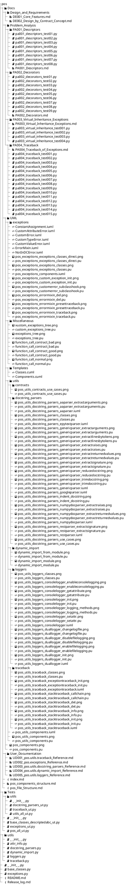

# File Structure (Full) of the Package pos

```plantuml
@startuml

salt
{
    {T
        pos
        + <&folder> Docs
        ++ <&folder> Design_and_Requirements
        +++ <&document> DE001_Core_Features.md
        +++ <&document> DE002_Design_by_Contract_Concept.md
        ++ <&folder> Problem_Analysis
        +++ <&folder> PA001_Descriptors
        ++++ <&script> pa001_descriptors_test01.py
        ++++ <&script> pa001_descriptors_test02.py
        ++++ <&script> pa001_descriptors_test03.py
        ++++ <&script> pa001_descriptors_test04.py
        ++++ <&script> pa001_descriptors_test05.py
        ++++ <&script> pa001_descriptors_test06.py
        ++++ <&script> pa001_descriptors_test07.py
        ++++ <&script> pa001_descriptors_test08.py
        ++++ <&document> PA001_Descriptors.md
        +++ <&folder> PA002_Decorators
        ++++ <&script> pa002_decorators_test01.py
        ++++ <&script> pa002_decorators_test02.py
        ++++ <&script> pa002_decorators_test03.py
        ++++ <&script> pa002_decorators_test04.py
        ++++ <&script> pa002_decorators_test05.py
        ++++ <&script> pa002_decorators_test06.py
        ++++ <&script> pa002_decorators_test07.py
        ++++ <&script> pa002_decorators_test08.py
        ++++ <&script> pa002_decorators_test09.py
        ++++ <&document> PA002_Decorators.md
        +++ <&folder> PA003_Virtual_Inheritance_Exceptions
        ++++ <&document> PA003_Virtual_Inheritance_Exceptions.md
        ++++ <&script> pa003_virtual_inheritance_test001.py
        ++++ <&script> pa003_virtual_inheritance_test002.py
        ++++ <&script> pa003_virtual_inheritance_test003.py
        ++++ <&script> pa003_virtual_inheritance_test004.py
        +++ <&folder> PA004_Traceback
        ++++ <&document> PA004_Traceback_of_Exceptions.md
        ++++ <&script> pa004_traceback_test001.py
        ++++ <&script> pa004_traceback_test002.py
        ++++ <&script> pa004_traceback_test003.py
        ++++ <&script> pa004_traceback_test004.py
        ++++ <&script> pa004_traceback_test005.py
        ++++ <&script> pa004_traceback_test006.py
        ++++ <&script> pa004_traceback_test007.py
        ++++ <&script> pa004_traceback_test008.py
        ++++ <&script> pa004_traceback_test009.py
        ++++ <&script> pa004_traceback_test010.py
        ++++ <&script> pa004_traceback_test011.py
        ++++ <&script> pa004_traceback_test012.py
        ++++ <&script> pa004_traceback_test013.py
        ++++ <&script> pa004_traceback_test014.py
        ++++ <&script> pa004_traceback_test015.py
        ++ <&folder> UML
        +++ <&folder> exceptions
        ++++ <&code> ConstantAssignment.iuml
        ++++ <&code> CustomAttributeError.iuml
        ++++ <&code> CustomError.iuml
        ++++ <&code> CustomTypeError.iuml
        ++++ <&code> CustomValueError.iuml
        ++++ <&code> ErrorMixin.iuml
        ++++ <&code> NotInDCError.iuml
        ++++ <&image> pos_exceptions_exceptions_classes_direct.png
        ++++ <&code> pos_exceptions_exceptions_classes_direct.pu
        ++++ <&image> pos_exceptions_exceptions_classes.png
        ++++ <&code> pos_exceptions_exceptions_classes.pu
        ++++ <&code> pos_exceptions_components.iuml
        ++++ <&image> pos_exceptions_custom_exception_init.png
        ++++ <&code> pos_exceptions_custom_exception_init.pu
        ++++ <&image> pos_exceptions_customerror_subclasshook.png
        ++++ <&code> pos_exceptions_customerror_subclasshook.pu
        ++++ <&image> pos_exceptions_errormixin_del.png
        ++++ <&code> pos_exceptions_errormixin_del.pu
        ++++ <&image> pos_exceptions_errormixin_presettraceback.png
        ++++ <&code> pos_exceptions_errormixin_presettraceback.pu
        ++++ <&image> pos_exceptions_errormixin_traceback.png
        ++++ <&code> pos_exceptions_errormixin_traceback.pu
        +++ <&folder> Miscellaneous
        ++++ <&image> xustom_exceptions_tree.png
        ++++ <&code> custom_exceptions_tree.pu
        ++++ <&image> exceptions_tree.png
        ++++ <&code> exceptions_tree.pu
        ++++ <&image> function_call_contract_bad.png
        ++++ <&code> function_call_contract_bad.pu
        ++++ <&image> function_call_contract_good.png
        ++++ <&code> function_call_contract_good.pu
        ++++ <&image> function_call_normal.png
        ++++ <&code> function_call_normal.pu
        +++ <&folder> Templates
        ++++ <&code> Classes.cuml
        ++++ <&code> Components.cuml
        +++ <&folder> utils
        ++++ <&folder> contracts
        +++++ <&image> pos_utils_contracts_use_cases.png
        +++++ <&code> pos_utils_contracts_use_cases.pu
        ++++ <&folder> docstring_parsers
        +++++ <&image> pos_utils_docstring_parsers_aaparser_extractarguments.png
        +++++ <&code> pos_utils_docstring_parsers_aaparser_extractarguments.pu
        +++++ <&code> pos_utils_docstring_parsers_aaparser.iuml
        +++++ <&image> pos_utils_docstring_parsers_classes.png
        +++++ <&code> pos_utils_docstring_parsers_classes.pu
        +++++ <&code> pos_utils_docstring_parsers_epytextparser.iuml
        +++++ <&image> pos_utils_docstring_parsers_genericparser_extractarguments.png
        +++++ <&code> pos_utils_docstring_parsers_genericparser_extractarguments.pu
        +++++ <&image> pos_utils_docstring_parsers_genericparser_extractlinesbytokens.png
        +++++ <&code> pos_utils_docstring_parsers_genericparser_extractlinesbytokens.pu
        +++++ <&image> pos_utils_docstring_parsers_genericparser_extractraises.png
        +++++ <&code> pos_utils_docstring_parsers_genericparser_extractraises.pu
        +++++ <&image> pos_utils_docstring_parsers_genericparser_extractreturnedvalues.png
        +++++ <&code> pos_utils_docstring_parsers_genericparser_extractreturnedvalues.pu
        +++++ <&image> pos_utils_docstring_parsers_genericparser_extractsignature.png
        +++++ <&code> pos_utils_docstring_parsers_genericparser_extractsignature.pu
        +++++ <&image> pos_utils_docstring_parsers_genericparser_reducedocstring.png
        +++++ <&code> pos_utils_docstring_parsers_genericparser_reducedocstring.pu
        +++++ <&image> pos_utils_docstring_parsers_genericparser_trimdocstring.png
        +++++ <&code> pos_utils_docstring_parsers_genericparser_trimdocstring.pu
        +++++ <&code> pos_utils_docstring_parsers_genericparser.iuml
        +++++ <&code> pos_utils_docstring_parsers_googleparser.iuml
        +++++ <&image> pos_utils_docstring_parsers_indent_docstring.png
        +++++ <&code> pos_utils_docstring_parsers_indent_docstring.pu
        +++++ <&image> pos_utils_docstring_parsers_numpydocparser_extractraises.png
        +++++ <&code> pos_utils_docstring_parsers_numpydocparser_extractraises.pu
        +++++ <&image> pos_utils_docstring_parsers_numpydocparser_extractreturnedvalues.png
        +++++ <&code> pos_utils_docstring_parsers_numpydocparser_extractreturnedvalues.pu
        +++++ <&code> pos_utils_docstring_parsers_numpydocparser.iuml
        +++++ <&image> pos_utils_docstring_parsers_restparser_extractsignature.png
        +++++ <&code> pos_utils_docstring_parsers_restparser_extractsignature.pu
        +++++ <&code> pos_utils_docstring_parsers_restparser.iuml
        +++++ <&image> pos_utils_docstring_parsers_use_cases.png
        +++++ <&code> pos_utils_docstring_parsers_use_cases.pu
        ++++ <&folder> dynamic_import
        +++++ <&image> dynamic_import_from_module.png
        +++++ <&code> dynamic_import_from_module.pu
        +++++ <&image> dynamic_import_module.png
        +++++ <&code> dynamic_import_module.pu
        ++++ <&folder> loggers
        +++++ <&image> pos_utils_loggers_classes.png
        +++++ <&code> pos_utils_loggers_classes.pu
        +++++ <&image> pos_utils_loggers_consolelogger_enableconsolelogging.png
        +++++ <&code> pos_utils_loggers_consolelogger_enableconsolelogging.pu
        +++++ <&image> pos_utils_loggers_consolelogger_getattribute.png
        +++++ <&code> pos_utils_loggers_consolelogger_getattribute.pu
        +++++ <&image> pos_utils_loggers_consolelogger_init.png
        +++++ <&code> pos_utils_loggers_consolelogger_init.pu
        +++++ <&image> pos_utils_loggers_consolelogger_logging_methods.png
        +++++ <&code> pos_utils_loggers_consolelogger_logging_methods.pu
        +++++ <&image> pos_utils_loggers_consolelogger_setattr.png
        +++++ <&code> pos_utils_loggers_consolelogger_setattr.pu
        +++++ <&code> pos_utils_loggers_consolelogger.iuml
        +++++ <&image> pos_utils_loggers_duallogger_changelogfile.png
        +++++ <&code> pos_utils_loggers_duallogger_changelogfile.pu
        +++++ <&image> pos_utils_loggers_duallogger_disablefilelogging.png
        +++++ <&code> pos_utils_loggers_duallogger_disablefilelogging.pu
        +++++ <&image> pos_utils_loggers_duallogger_enablefilelogging.png
        +++++ <&code> pos_utils_loggers_duallogger_enablefilelogging.pu
        +++++ <&image> pos_utils_loggers_duallogger_init.png
        +++++ <&code> pos_utils_loggers_duallogger_init.pu
        +++++ <&code> pos_utils_loggers_duallogger.iuml
        ++++ <&folder> traceback
        +++++ <&image> pos_utils_traceback_classes.png
        +++++ <&code> pos_utils_traceback_classes.pu
        +++++ <&image> pos_utils_traceback_exceptiontraceback_init.png
        +++++ <&code> pos_utils_traceback_exceptiontraceback_init.pu
        +++++ <&code> pos_utils_traceback_exceptiontraceback.iuml
        +++++ <&image> pos_utils_traceback_stacktraceback_callchain.png
        +++++ <&code> pos_utils_traceback_stacktraceback_callchain.pu
        +++++ <&image> pos_utils_traceback_stacktraceback_del.png
        +++++ <&code> pos_utils_traceback_stacktraceback_del.pu
        +++++ <&image> pos_utils_traceback_stacktraceback_info.png
        +++++ <&code> pos_utils_traceback_stacktraceback_info.pu
        +++++ <&image> pos_utils_traceback_stacktraceback_init.png
        +++++ <&code> pos_utils_traceback_stacktraceback_init.pu
        +++++ <&code> pos_utils_traceback_stacktraceback.iuml
        ++++ <&code> pos_utils_components.iuml
        ++++ <&image> pos_utils_components.png
        ++++ <&code> pos_utils_components.pu
        +++ <&image> pos_components.png
        +++ <&code> pos_components.pu
        ++ <&folder> User_Documentation
        +++ <&document> UD001_pos.utils.traceback_Reference.md
        +++ <&document> UD002_pos.exceptions_Reference.md
        +++ <&document> UD003_pos.utils.docstring_parsers_Reference.md
        +++ <&document> UD004_pos.utils.dynamic_import_Reference.md
        +++ <&document> UD005_pos.utils.loggers_Reference.md
        ++ <&info> index.md
        ++ <&document> pos_components_structure.md
        ++ <&info> pos_File_Structure.md
        + <&folder> Tests
        ++ <&folder> utils
        +++ <&script> _ _init_ _.py
        +++ <&script> docstring_parsers_ut.py
        +++ <&script> traceback_ut.py
        +++ <&script> utils_all_ut.py
        ++ <&script> _ _init_ _.py
        ++ <&script> base_classes_descriptedabc_ut.py
        ++ <&script> exceptions_ut.py
        ++ <&script> pos_all_ut.py
        + <&folder> utils
        ++ <&script> _ _init_ _.py
        ++ <&script> attr_info.py
        ++ <&script> docstring_parsers.py
        ++ <&script> dynamic_import.py
        ++ <&script> loggers.py
        ++ <&script> traceback.py
        + <&script> _ _init_ _.py
        + <&script> base_classes.py
        + <&script> exceptions.py
        + <&info> README.md
        + <&info> Release_log.md
    }
}

@enduml
```