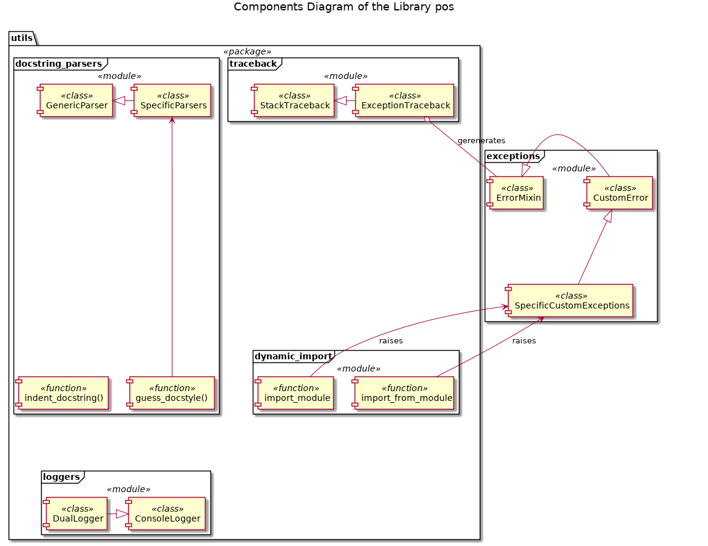

# Components Structure of the pos Library

* package **utils**
  - module **attr_info** [source](../utils/attr_info.py), [documentation]
    * class AttributeInfo
    * class FieldInfo
    * class MethodInfo(AttributeInfo):
  - module **docstring_parsers** [source](../utils/docstring_parsers.py), [documentation](./User_Documentation/UD003_pos.utils.docstring_parsers_Reference.md)
    * class GenericParser
    * class EpytextParser
    * class reSTParser
    * class GoogleParser
    * class AAParser
    * class NumPydocParser
    * function guess_docstyle()
    * function indent_docstring()
  - module **dynamic_import** [source](../utils/dynamic_import.py), [documentation](./User_Documentation/UD004_pos.utils.dynamic_import_Reference.md)
    * function import_module()
    * function import_from_module()
  - module **loggers** [source](../utils/loggers.py), [documentation](./User_Documentation/UD005_pos.utils.loggers_Reference.md)
    * class ConsoleLogger
    * class DualLogger
  - module **traceback** [source](../utils/traceback.py), [documentation](./User_Documentation/UD001_pos.utils.traceback_Reference.md)
    * class StackTraceback
    * class ExceptionTraceback
* module **base_classes** [source](../base_classes.py), [documentation]
  - class DescriptedABC_Meta
  - class DescriptedABC
* module **exceptions** [source](../exceptions.py), [documentation](./User_Documentation/UD002_pos.exceptions_Reference.md)
  - class ErrorMixin
  - class CustomError
  - class DesignContractError
  - class ConstantAssignment
  - class CustomAttributeError
  - class ConstantAttributeAssignment
  - class NotExistingAttribute
  - class PrivateAttributeAccess
  - class NotInDCError
  - class CustomTypeError
  - class DCArgumentType
  - class DCReturnType
  - class CustomValueError
  - class DCArgumentValue
  - class DCReturnValue

